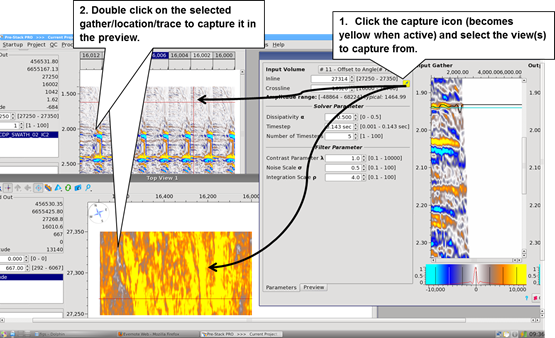

# Functionalities

The control of input and output previews for zooming and histogram are the same as in the gather and stacks viewer, please refer to these sections.

Some pairs input/output have the histogram not synchronize as a default, for example for the Gaining algorithm.

**Gather Catching:**

You can select a location to display in the preview by a double-click in any viewer. It will either select the exact location clicked if it exists in the input volume of the algorithm or the nearest one the location clicked is not in the input volume.

Click on the pipette icon right of the inline/crossline field and double-click in any viewer to link it to the previews. The icon turns yellow to notify it is linked to a viewer. A single click in that viewer will send the location of the click to the preview. The corresponding inline-crossline gather will be displayed immediately in the **Input Gather** field of the process window.

_Gather catching mechanism_

