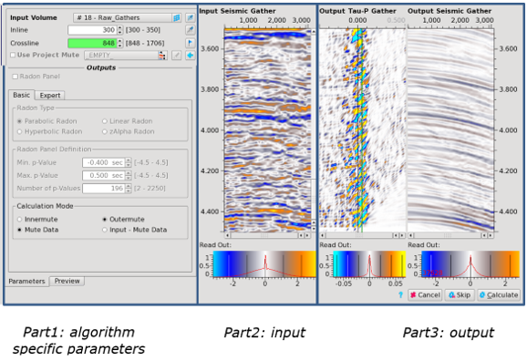
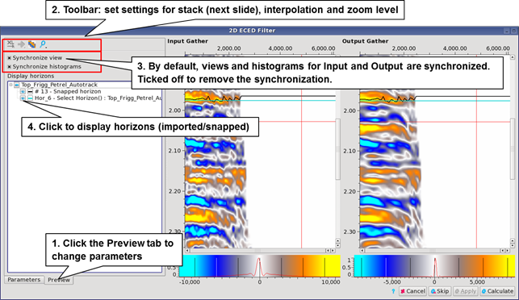
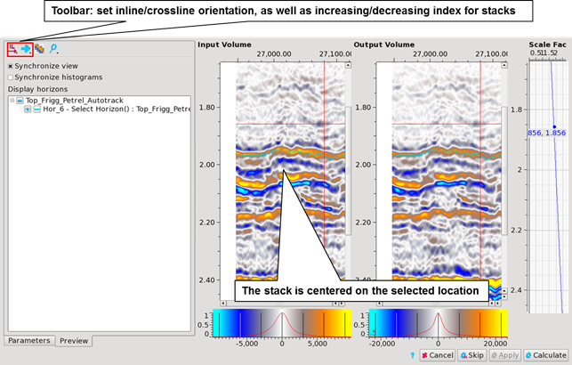
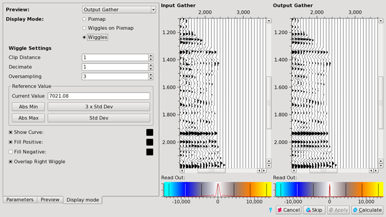

# Overview

All the processes have a different purpose, therefore their dialog windows and parameters vary considerably.

Many of them have parameters which can only be optimized by the use of interactive parameter setting and testing on a number of gathers. For example, Radon and stack mute design, Align 2 time window and smoothing parameters, benefit hugely from interactive trial and error testing.

These processes have a similar user interface, composed of three parts described below.

_Overview of the Radon process window_

## **Part 1: algorithm specific parameters:**

The top section is the **Input Selection**. This is used to define the displayed inline-crossline pair gathers, as well as to define the input volumes. You can select any volume loaded in memory by clicking on the  icon or alternatively, you can  click on this icon: at the right of the volume name, to select a volume displayed in any 2D viewer or directly in the Data Pool.

You can type in any location in the inline/crossline fields. If the exact location does not exist in the input volume, it will choose the nearest one. You can also select any location from a 2D viewer \(including Map Viewer\) using this icon: 

The selected viewer will then be linked to the preview and a double-click at a location inside that viewer will update the location for the preview. Additionally, a cross showing the location of the gather being previewed will appear if the viewer is a Map Viewer.

Another method is to used Location Of Interest: click on the icon  to select a set of location of interest. You have access to the list of all locations contained in the set.

Selecting a location in the set will automatically jump to the \(closest\) position in the preview. If the closest selection is the same as the one defined in the Location of Interest object, the inline and crossline field will have a green background.

The current location selected in a Preview can be added to the current Locations of Interest object by clicking on the  icon.

Some Algorithms will need multiple inputs. In addition of seismic information, horizons, and velocities … type of information is needed.

The bottom section is algorithm specific. All the parameters for the selected algorithm will be selected here. Please refer to the process specific section of this manual.

The tab **Preview** let the user control the objects displayed in the previews such as horizons, wells, etc. Synchronization of the views and histograms is setup in this tab, as well the viewer settings such as X-Axis orientation and interpolation.

_Preview settings_

_Preview settings for stacks_

The **Display mode tab** gives you the option to use **wiggle plots**. Select the volume of interest in the Preview tab and choose to display only wiggles or wiggles as an overlay on the pixmap. Wiggle settings are synchronized for all viewers but can be defined independently if you deselect the synchronization option in the Control panel.

_Display mode tab to change display to wiggle plot_

## **Part 2: the input:**

The **Input Gather** field displays the gather corresponding to the inline - crossline pair shown in the **Volume Parameter** box.

A color histogram is shown on the lower left. The adjustments of the color setting are like the ones in the viewer tab -&gt; [Histogram](../../viewers/functionalities_common_to_all_viewers/histograms.md).

This input tab is very interactive thanks to an option that allows the user to access several functionalities such as gather catching or other algorithm specific functionalities -&gt; [Functionalities](../../viewers/functionalities_common_to_all_viewers/)

## **Part 3: the output:**

In this section, the result of the algorithm is displayed at the current inline – crossline location.

For some algorithms, which generate several types of output, the selection of the one to display is done by the preview tab.

This section usually contains between 2 and 4 buttons \(some are activated only when the GUI is opened in the mode “Edit this algorithm”\).

* Calculate: close the GUI and compute the results. If you are in “Edit this algorithm” mode, the output volume is overwritten
* Cancel: close the GUI without computing any results
* Skip: skip this algorithm \(in workflow\)
* Apply: available in “Edit this algorithm” mode only. The results are re-computed after a change of parameters while keeping the GUI open. The output volume is over-written. 

