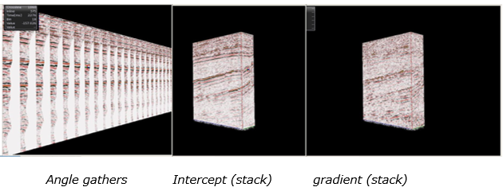
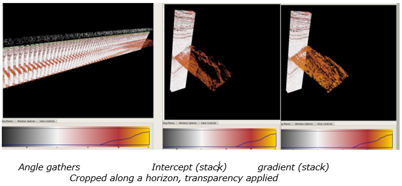

# AVA Attribute Calculator

The AVA Attribute Calculator can help you to do your AVA analysis by calculating different attribute such as gradient and intercept.

Go to: **Attributes** → **AVA Attribute Calculator**

The algorithm uses pre-stack seismic volumes in the angle/time domain only.

To convert data from the offset to the angle domain please go to: [Offset to angle](../readme.4/offset_to_angle.md)

For the calculation of the Fluid Factor, an interval velocity with the same dimensions as the input seismic is required. For easy use, this can be selected using the drop down list from the GUI.

**Attribute selection:** This selection defines the output of the algorithm. Choose any Attribute by clicking the relevant check box. It will automatically add a preview panel with a preview of the attribute at the location selected in the inline/crossline boxes.

For some attributes, additional parameters are required. The corresponding GUI elements will be displayed. All attributes require a minimum and a maximum angle.

**Intercept, Gradient and Curvature:**

$$
R(\theta) = R_P+GSin^2\theta + C (Tan^2\theta-Sin^2\theta)
$$

The intercept $$R_P$$, gradient $$G$$ and curvature $$C$$are the three coefficients from the 3-term Shuey AVA equation above, with $$\theta$$ incidence angle, on the horizontal axis. For $$\theta$$inferior to 30 degrees, the third term can be ignored.   
The intercept or P-wave reflectivity includes both, the relative change of P-wave velocity and the relative change of density. 

$$
R_P = 1/2(\Delta V_P / V_P+\Delta \rho/\rho)
$$

Having calculated $$R_P$$ and gradient $$G$$ from the angle gathers we can now derive other AVA attribute poststack volumes, using various assumptions about the reservoir rocks, and the equations shown below. See Oz Yilmaz’s SEG book for more details.

\( Oz Yilmaz, Seismic Data Analysis, Vol 2, SEG investigations in geophysics No 10, pages 1816 – 1839 \)

When choosing to output one or more of the 3-term attributes, several more QC are available to output such as the attributes correlation coefficient and the weights if the robust method is chosen.,

**Poisson’s ratio change:**

$$
\Delta \sigma = 4/9(R_P+G)
$$

which is derived from $$G = R_P H_0 + \frac{\Delta \sigma}{(1-\sigma)^2}$$ with the assumption of $$\sigma = 1/3$$ and $$H_0 = -1$$.

**S wave reflectivity:**  
$$R_S = 1/2(R_P-G)$$

under the assumption of $$V_S/V_P = 0.5$$.

**P and S wave reflectivity \(Gardner equation\):**

$$
R(\theta) = a(\Delta V_P/V_P)+b(\Delta V_S/V_S)
$$

$$\Delta V_P/V_P$$ and $$\Delta V_S/V_S$$ are calculated from the Aki – Richards equation above, which has densities replaced by velocities, assuming the Gardner equation $$\rho = KV_P^{1/4}$$ can be applied.

Differentiating the Gardner equation leads to $$\Delta \rho/\rho = 1/4\Delta V_P/V_P$$ and inserting this term into the original Aki-Richards equation provides the relative changes of P-wave and S-wave velocity as a solution of a simple least-mean square problem.

In addition, a sensible value for $$V_P/V_S$$ needs to be chosen. This is the Smith and Gidlow approach.

**Pseudo Poisson reflectivity:**

$$\Delta \sigma\prime/\sigma\prime = \Delta V_P/V_P-\Delta V_S/V_S$$ with the relative changes of velocities as in the previous step.

**Fluid factor:**

Based on Mudrock line $$V_P = C_0+C_1V_S$$

$$C_0$$ an $$C_1$$ are empirically determined for various rocks, e.g. $$C_0=1360 m/s$$ for water saturated clastics.

$$
\frac{\Delta V_P}{V_P} = C_1\frac{V_S}{V_P}\frac{\Delta V_S}{V_S}
$$

$$
\Delta F = \frac{\Delta V_P}{V_P}-C_1\frac{V_S}{V_P}\frac{\Delta V_S}{V_S}
$$

$$
\Delta F = \frac{\Delta V_P}{V_P}+C_0\frac{1}{V_P}\frac{\Delta V_S}{V_S}
$$

**Run test:**

QC measure for AVA curve fitting. This provides a statistical measure of whether a straight-line fit with $$sin^2(\theta)$$ is justified for the AVA data.

\( Appendix D, from A.T. Waldens’s paper, “Making AVO sections more robust “ , Geophysical Prospecting, 39, 1991 \)

**NRMSE:**

This QC is used to identify zones where the seismic data does not fit with the AVO model.

**Coherency, semblance:**

The semblance is the measure of multichannel coherence, the energy of a sum trace divided by the mean energy of the component of the sum.it is basically the energy of the stack normalized by the mean energy of the components of the stack. This is equivalent to the zero-lag value of the autocorrelation of the sum trace divided by the mean of the zero-lag values of the autocorrelations of the component traces.

**Angle range:**  
These parameters allow to specify in more detail the desired attributes. For all attributes, a minimum and maximum angle can be set: angles smaller than α$$_{min}$$ or larger than α$$_{max}$$ are cut \(sort of a mute function\).

For Intercept and Gradient calculation, a robust version is available. It uses a weighting scheme on the far angles amplitude values.

The other parameters \($$V_S/V_P$$-Ratio, Mudrock Line Intercept and Noise Percentage\) are used for the P-Wave Reflectivity, Fluid Factor and Coherency calculation. All of the parameters are set to a sensible default value.

**The Filter Half-length** will be used for Intercept and Gradient if Using Lateral Smoothing is checked.

Those cubes can be [sculpted](../readme.4/sculpt.md) along a horizon of interest. Thanks to the transparency option, the AVA effect can be analyzed.

