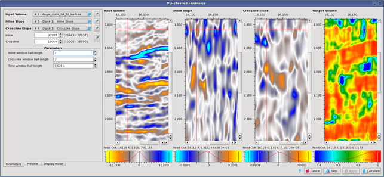

# Dip-steered Semblance

Go to **Attributes** → **Dip-steered Semblance**

This algorithm is an extension of the semblance attribute found in [Moving Window Statistics](moving_window_statistics.md).

_Dip-steered Semblance GUI_

**Input volumes**

The algorithm works per offset classes on either stacked or pre-stack volumes. In addition, it requires the inline and crossline slope values computed on the input volume. Those attributes can be obtained using the [Structural Dip](structural_dip.md) algorithm.

**Parameters**

Parameters correspond to the stencil half lengths in the inline, crossline and time directions. The semblance will be computed inside this stencil using inline and crossline slopes to follow dipping events, resulting in a better estimation of the signal coherency for structures with large dips than with conventional vertical moving windows.

