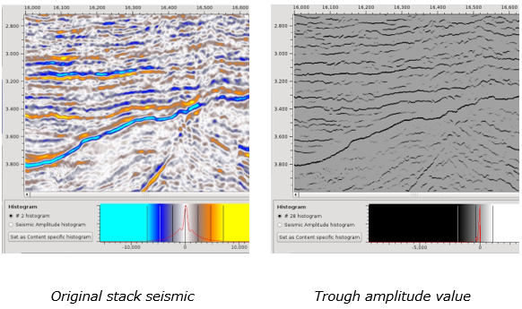

# Extrema

Go to **Attributes** → **Extrema**

It outputs the position of the peak/trough and the value of the maximum of the peak/trough within a moving window.

**Output volumes**

* Extrema peak/trough: mask volume indicating with a value of 1 the position of the peak/trough
* Peak/trough: the amplitude value corresponding to the position of the extrema.

Extrema volumes can make sequence stratigraphic interpretation easier and provide an easy way to extract seismic reflection events from volumes for crossplots etc.

