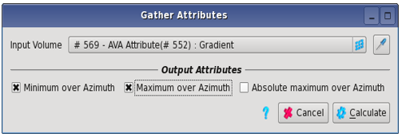
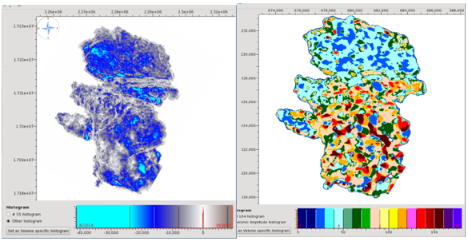
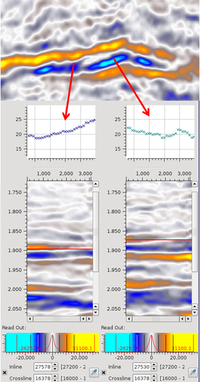
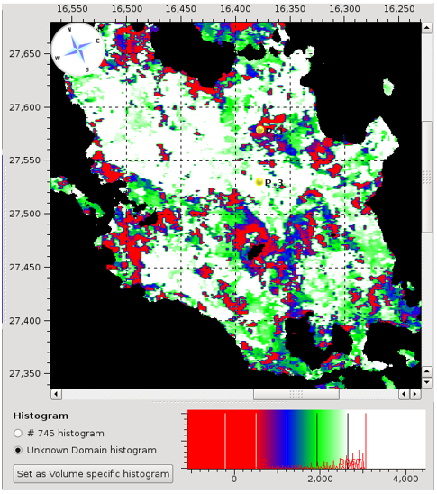

# Gather attributes

Gather attributes can be found in **Attributes** → **Gather Attributes**.

**Input:** These attributes can be computed on any volumes that possess at least one «gather dimension» \(pre-stack volumes\). Such a dimension can be: offset, angle, azimuth, frequency, other...

Computation is performed vertically, slice by slice. Each attribute will output two volumes. In the case of 4D inputs, both outputs will be 3D \(reduction of the pre-stack dimension\). In the case of 5D inputs, outputs will be either 4D \(reduction of one of the gather dimensions\) or 3D \(reduction of both gather dimensions\) depending on the user’s choice.

**Output**

* **Minimum over gather dimension:** For each cdp position, the algorithm will scan the input volume values in the gather direction, vertical slice by vertical slice, looking for the minimum value. The first output volume will consist of these ‘minimum over gather dimension’ values. The second output volume will contain the gather dimension value itself at which the minimum value was found.
* **Maximum over gather dimension:** Will produce the equivalent two output volumes as above for the maximum value over the gather dimension.
* **Absolute maximum over gather dimension:** Will produce the equivalent two volumes as above for the maximum absolute value over the gather dimension.

**Example 1**  
In a multi-azimuth survey, we input a gradient map computed by azimuth sectors along a horizon. We use the gather attributes to find the maximum and minimum gradient values, as well as their corresponding azimuth.

  
_Gather attributes for an azimuthally dependent gradient map_

  
_Output of the minimum over azimuth gradient: Left is the minimum gradient map and right is the map containing the corresponding azimuth of this minimum gradient._

**Example 2**

We create a ‘minimum average instantaneous frequency’ offset map, along a horizon, to study gather character.

First, we create an average instantaneous frequency map volume, around the top reservoir yellow peak event.  
Then we use the Gather Attributes option to find the lowest frequency value, and the offset at which this occurs.  
The map below shows the offsets at which the lowest frequency was found: white=far offset; red=near offset.  
In most gathers, far offsets have a lower frequency content, so we would expect to see white on the map. Red locations indicate unusual gather frequency character at the top reservoir.  
The left hand gather is from a red map location \(POI\) and clearly has increasing frequency content with offset around the red event.  
The right hand gather is from a white ‘normal’ gather character location and has decreasing frequency with offset.

_Minimum instantaneous frequency, Offset map  
\(The 2 yellow POI gathers are shown above\)_

