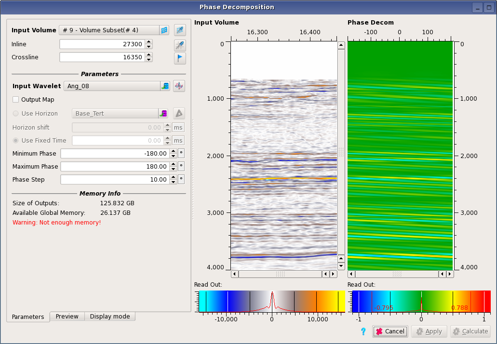

# Phase Decomposition

This technique is a form of discontinuity detection. It is useful to highlight onlaps, pinchouts and other forms of discontinuity. The user supplied a wavelet, typically a zero phase statistical wavelet. This is phase rotated by a series of steps, and the results are cross-correlated with the data. The result is a map or volume of correlation coefficients between the phase-rotated wavelets and the seismic data. High correlation values indicate similarity of phase. This means, for example, that an isolated event might have high correlations at phase values close to zero, but where there is a pinchout interfering a high correlation would be expected at phase values closer to +/- 90 degrees. The user can scan though the correlations for dierent phase values in map view to identify features of interest.

**Input Data:** input volume is of type seismic and can be stacked or pre-stack. The input wavelet must be zero-phase.

**Minimum Phase, Maximum Phase and Phase Step:** range of the phase rotation applied to the input wavelet. 

The output will be a volume of the same geometry as the input except for an extra gather axis for the phase.

**Output Map**: if ticked on the output will be a map instead of a full volume, either at a **Horizon** or a constant **fixed time**. 

