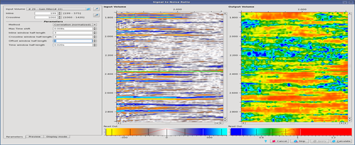
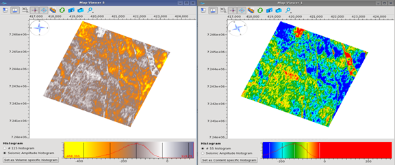

# Signal to Noise Ratio

Go to **Attributes** → **Signal to Noise Ratio.**

S2N is defined as the ratio between the signal power and the noise power. Two methods have been implemented to compute this attribute, a **correlation** based and a **stack** based approach.

**Input:** The attribute takes a single seismic volume as input, either stacked or pre-stack.

**Parameters:** Both methods are stencil based. The user has to specify the size of the stencil in every dimension \(Inline, Crossline, Fold\(s\), time/depth\). Additionally, a parameter called Max Time-Shift \(equivalent to the lead/lag parameter\) is available for the correlation based method.

_S2N Ratio GUI_

**Modes of calculation:**

**Correlation:**  
This method will compare \(in a correlation sense\) the similarity between the central trace and its neighbour traces inside the stencil. If we denote by $$AC$$ the autocorrelation of the central trace and $$XC$$ the average cross-correlation between the central trace and its neighbours, the signal to noise ratio is given by:

$$
S2N = \frac{XC}{AC-XC}
$$

The original method is performed with non-normalized correlation function. However, the user has the possibility to use the normalized correlation to compute the signal to noise **relation** as it will generally give much less spikes in the output. Assumptions behind the method are that the form and phase of the signal is consistent inside the stencil and that the noise is spatially incoherent and uncorrelated to the signal.

**Stack:**  
We denote by $$i$$ the spatial sampling index inside the stencil \($$M$$ traces\) and $$j$$ the temporal index \($$N$$ samples\). For a seismic record $$x_{i,j}$$ the signal to noise ratio is given with the following logarithmic relation:

$$
SNR = 10\log_{10}(\frac{\sum _{j=1}^N(\sum _{i=1}^Mx_{i,j})^2}{M\sum_{j=1}^N\sum_{i=1}^Mx_{i,j}^2-\sum _{j=1}^N(\sum _{i=1}^Mx_{i,j})^2})
$$

This method assumes that the seismic wavelet is stable inside the stencil and that the noise is white. Therefore, the energy of the signal is given as the spatial sum of the square of the stacked trace and the energy of the noise is defined as the total energy minus the energy of the signal.

_Amplitude map \(left\) and extracted signal to noise ratio \(right\) at a horizon_

