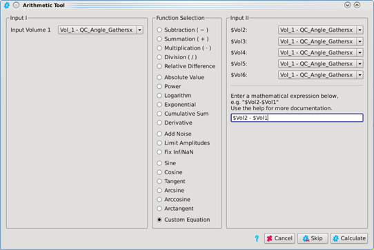
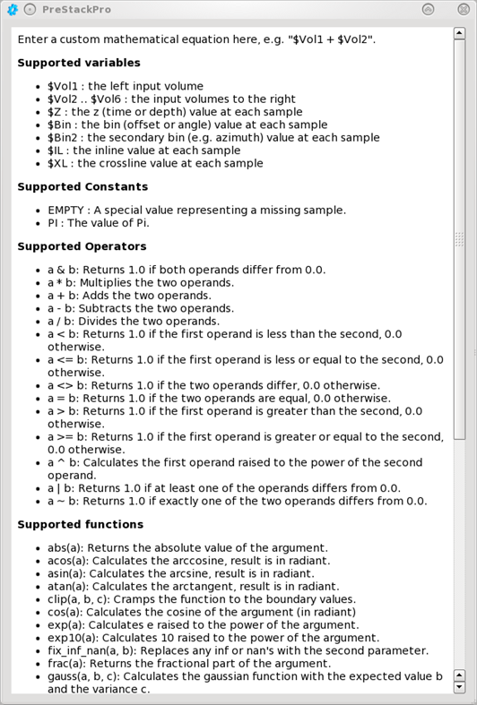

# Custom equation

The user can enter a custom equation having up to 6 inputs.

_Custom equation_

The list of supported mathematical is exhaustive and in addition to any of the 6 input volumes, the fold or time/depth term is usable.

_List of mathematical operations supported by the Custom Equation option_

