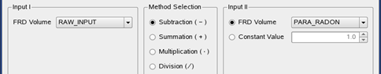
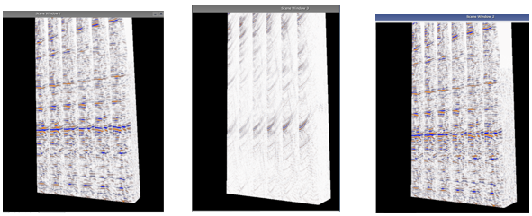

# Subtraction, summation, multiplication, division

This volume calculator can be used to QC the impact of a processing algorithm on the data. The data removed by an algorithm can be displayed.

In the following example, we can see the impact of a parabolic radon filter.

  
_Arithmetic tool used to calculate the difference between the input data \(input I\) and the parabolic radon filtered data \(input II\)_

_Results on 3 viewers, histograms synchronized Raw input - Result of the subtraction – radon filtered data_

