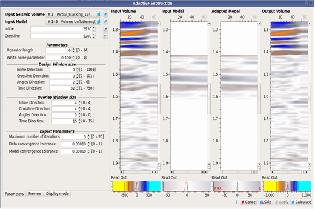

# Adaptive Subtraction

The adaptive subtraction technique can be used to remove multiple reflections from the seismic data. Multiples models can be predicted from interpreted horizons. Typically, the multiple projections will not be perfect. The adaptive subtraction algorithm will match the amplitude, phase and frequency distortions of the model to the seismic data.

**Processing** → **Adaptive Subtraction**

The geometry of the model must match the seismic; either gathers or stacks.

The **design window** parameters are used to control the strength of the filter.

The **overlap** should be as large as possible to achieve the best results.

The **operator length** \(in samples\) and **white noise** parameters can be tuned to get the desired result.

_Adaptive Subtraction Parameters_

