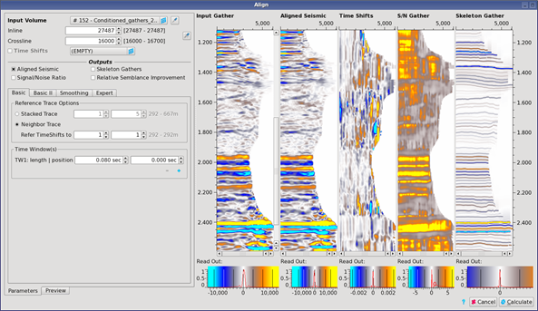
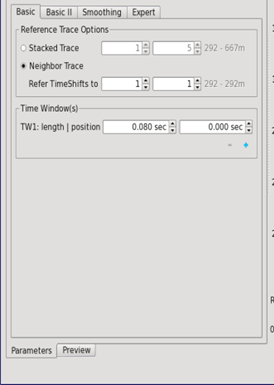
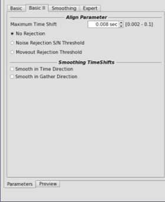
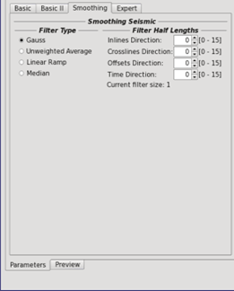
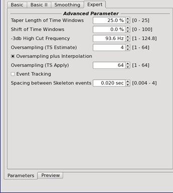

# Align 2

Similarly to **Semblance Optimization**, this algorithm will attempt to maximize the flatness and smoothness of the AVO response by timeshifting and aligning events.

The process accepts both gathers in offset domain and angle domain.

  
_Align dialog_

**Left part of the window:**

**Data selection**

The data selection is used to select the seismic input volume and, if needed the timeshifts. The inline and crossline for the preview calculation can be selected.

If you select a Timeshift volume in addition to the Input Volume and ticked on the box **TimeShifts**, then the module will just apply the selected timeshift field to the input volume.

**Select Outputs:**

Allows to create extra QC output volumes:

* **Aligned Seismic:** creates the aligned seismic output. This is ticked on by default.
* **Signal/Noise Ratio:** creates an S/N ratio output volume
* **Skeleton Gather:** creates a Skeleton Gather output volume. The spacing between Skeleton events can be specify in the Expert tab \(0.020sec by default\)
* **Semblance:** creates an output volume of the semblance trace for each input gather 

**Basic I:**

Set of the most basic parameters for the algorithm.

_Basic I tab_

**Reference Trace Options:**

In this section the focus is on whether the timeshifts are calculated with respect to the neighboring trace or to a stacked pilot trace.

* **-Neighbor Trace:** the timeshifts are calculated by adjacent trace pairwise cross-correlation and set to be with respect to the selected trace.
* **-Stacked Trace:** the timeshifts are calculated with respect to a pilot trace which is constructed by stacking traces between “from” and “to”.

**Time Windows:**

Timeshifts are estimated in up to four windows of varying length and position. Pressing the “+” adds another time window. “-“, removes it. A timeshift is estimated at each window location for each trace of the gather. The timeshifts that are applied to the data are obtained by interpolation between the values obtained at each window locations.

**Basic II**

Set additional basic parameters for the algorithm

  
_Basic II tab_

**Align parameter**

* **-Maximum timeshift:** is the maximum of the picked timeshift allowed in absolute value. The recommended value is less than ¼ of the minimum window length. Typically, 0.008sec is a good value for the neighbor trace option.
* **-Noise rejection S/N ratio:** this option allows to reject time picks if the estimated S/N ratio level is less than the specified value.
* **-Moveout Rejection Threshold:** this option allows to rejects events if the absolute value of the total moveout from the near to far trace is greater than the specified value.

**Smoothing TimeShifts**

* **-Smooth in Time direction:** the estimated timeshifts are smoothed over the specified time window. The tolerance is a percent of the maximum time shift
* **-Smooth in Offset Direction:** the estimated timeshifts are smoothed over the specified offset window. Smoothing is performed for each sample by comparing the timeshift and averaging it over the number of traces specified by the offset Window length parameters. If the absolute value of the difference between the timeshift and the averaged value is greater than the tolerance, the value is replaced by the average.

**Smoothing**

Set parameters for an intermediate smoothing step on the calculated timeshifts

_Smoothing tab_

**Expert Parameters:**

* **-Taper Length of Time Windows:** defines, in percentage of the window length, the taper apply on the hedge of each window. The recommended value is 25% 
* **-Shift of Time Windows:** defines, in percentage of the window length the shift down of the window. 
* A shift of 0% implies a shift of 1 sample: the timeshift estimation occurs at every sample location of the data. A shift of 100% implies a shift of one window length with no window overlap. 
* 0% is recommended if possible but can be time intensive. As a rule of thumb, this value should not be greater than 25%
* **-3dB High Cut Frequency:** -3dB point for the cross correlation high cut filter. The recommended value is ¾\*Nyquist
* **-Factor for Oversampling in Time:** derived cross correlation are re-sampled by this factor prior estimation of the timeshift. This value must be a power of 2. The recommended value is 16
* **-Event Tracking:** this parameter adjusts the start-time of the picking of the event across the gather.
* This option should only be used if     -a reference stacked trace is used -the events vary more than the set processing window length.  

**Filter Type:**

The parameters of the filter type can be set on the Filter Half Lenghts sub part of the tab.

* **-Gauss:** will do a gauss smoothing. The values of the filter coefficients follow a Gauss curve in all directions, symmetrically from the center.
* **-linear ramp:** will apply a weighted averaged filter with the coefficients decreasing linearly proportionally to the distance to the center.
* **-unweighted average:** will do an unweighted average over the full  filter, all the filter coefficients have the same value.
* **-unweighted average \(cross\):** will apply an unweighted average filter over the selected main directions.  

**Filter Half Lengths:**

In this part we can select the lengths of the filter in the Inline and Crossline direction.

**Filter Info:**

This tab indicates the size of the current filter in all direction. The runtime for the smoothing is linearly proportional to the size of the filter

**Expert:**

Set of the expert parameters for the algorithm. Only recommended for experienced users.

_Expert tab_

**Right part of the window:**

Preview of the **output** of the algorithm with the current parameters. Besides the actual input and output gathers, additional QC output can also be displayed like S/N, Skeleton gathers or the estimated time shift. This selection can be done in the preview tab.

