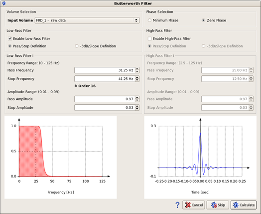
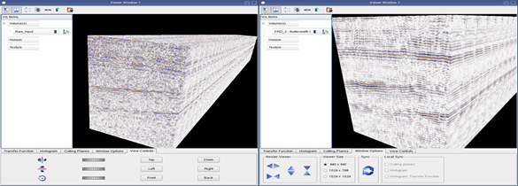

# Butterworth Filter

Butterworth filters are designed to have a maximally flat frequency response in the passband without changes in the amplitude. Their smooth roll off ensures a compact response in the time domain. **Zero Phase** and **Minimum Phase** options are available.

Go to: **Processing** → **Butterworth Filter**

_Butterworth filter dialog: low pass with the -**3dB/slope Definition**_

The Butterworth filter requires a seismic input volume in the time domain as input. The selection automatically shows only the valid input volumes.

**Low- and high-pass filter** can be turned on/off separately. Not only a low-pass and a high-pass are possible, but also a bandpass with both options enabled.

There are two additional options to define the filter: Either using stop and pass frequencies and amplitudes for each filter or using a -3dB frequency together with a slope.

* -**Stop pass filter:** Start and stop frequency define the range of frequencies that is filtered while the corresponding start and stop amplitudes are defining how fast steep the filter gets.
* -**3dB frequency:** the signal is filtered 50%.The order defines how steep the filter gets.

The **frequency range** plot displays which frequencies are filtered out \(0\) and which are kept \(1\).

The **filter response** plot shows the response of the currently selected filter to a simple peak signal at 0.1 sec for the minimum phase, 0.0 sec for the zero phase response.

_Before-After comparison of the same data left before and on the right with the Butterworth lowpass applied._

