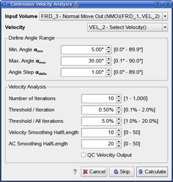

# Continuous Velocity Analysis

The algorithm updates the velocity field on a dense grid and applies NMO corrections with the goal of flattening events in the gathers.

The module takes volumes with NMO corrections removed as input. The output will be NMO corrected gathers.

To open the dialog window, go to: **Processing** → **Continuous Velocity Analysis**

_Continuous velocity analysis_

When given the **Input Volume** and **Velocity** field, the algorithm will attempt to update the velocity field within the limits given by **Threshold/Iteration** for each iteration.

We recommend starting with a small number of iterations and applying additional iterations if necessary. The overall change to the velocity field is limited by the **Threshold/All Iterations** parameter.

The **Velocity Smoothing Half Length** controls the smoothing of velocity in the vertical direction, with a higher number resulting in more smoothing.

