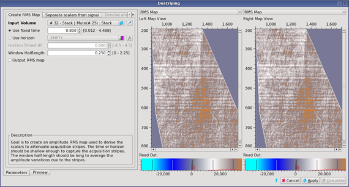

# Destriping

The destriping wizard attenuates acquisition footprints on stacked data. It creates scalars and applies them on the input volumes.

Optional QC outputs include RMS maps of the volume before and after application of the scalars; the scalar maps; and all intermediate steps.

Go to: **Processing** → **Destriping**

The algorithm is a wizard. The user needs to go through 4 steps which are unlocked sequentially. Once they have been unlocked, it is possible to go back and change the earlier parameters. This will update the subsequent steps.

_Destriping GUI. The previews have a menu to change the visible map. The right preview automatically show the results of the current step. The Apply button will compute this step and unlock the next one. The Calculate button will be available once all parameters for the 4 steps are setup._

**Create RMS Map:** Create an amplitude RMS map used to derive the scalars to attenuate the acquisition stripes. The time or horizon should be shallow enough to capture the stripes. The window half-length should be long to average the amplitude variations due to the stripes.

**Separate scalars from signal:** The signal needs to be separated from the stripes. One or two passes of a large square median filter will achieve this.

**Denoise and smooth scalars:** The scalar map might be contaminated by noise. They need to be smooth in the acquisition direction to avoid introducing unwanted spatial amplitude variations. This is done by applying one or two passes of a median filter with a long length in the crossline direction, and a short one \(shorter than the cable spread\) in the inline direction.

**Apply scalars to input stack:** This step will apply the scalars to the same stack used to derive them. A RMS QC map is created using the same parameters than the first step by default.

