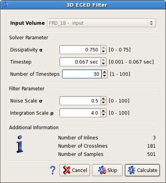
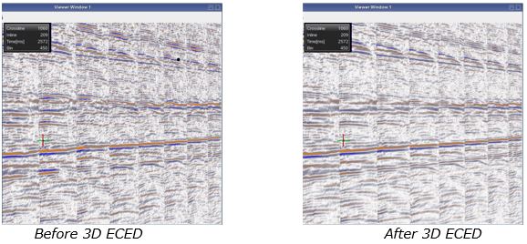

# ECED 2D and 3D

ECED is an algorithm especially designed for random noise removal. It is an edge- and coherency-enhancing anisotropic diffusion filter. It applies a spatial filter following the local dip. ECED is either applied in the offset direction \(ECED 2D\), or on offset cubes \(ECED 3D\).

To open the ECED parameter dialog go to: **Processing** → **2D ECED filter** or **3D ECED filter**

_3D ECED filter options_

Smoothing is achieved by iteratively solving a diffusion equation.

With a scalar diffusivity coefficient, the process would create an isotropic smoothing, thus a smearing of amplitudes in all directions with, consequently, loss of resolution. Instead, the ECED makes use of a diffusion tensor that causes the filter to perform the smoothing only along reflectors while there is no or very little smoothing perpendicular to them. In order to adapt the diffusion process to the local image structure, the diffusion tensor uses the same eigenvectors as the structure tensor while the latter is obtained from the tensor product of the vector of spatial derivatives of the image-amplitudes.

The component of the diffusion tensor corresponding to the direction of the largest eigenvalue of the structure tensor \(perpendicular to the reflector\) is set to a very small value while the other two components are set to 1. Input amplitudes and the components of the structure tensor might be smoothed \(see scale-parameters below\) prior to computing the eigenvectors of the structure tensor.

**Solver Parameter:**

**Dissipativity:** this parameter influences the spatial discretization of the diffusion model. Higher values of this parameter will lead to low dissipativity and high directional accuracy. Small values perform relatively poorly.

**Timestep:** defines the size of a single step of the numerical solver. Maximum size is calculated and set as default value.

**Number of Timesteps:** number of timesteps the solver should perform. Values between 5 and 10 are recommended.

The intensity of filtering is controlled by the product of **TimeStep** and the **Number of Timesteps**. A bigger product will result in a stronger filtering effect. The runtime depends on the number of time-steps. Therefore, we recommend keeping the **TimeStep** parameter as large as possible and minimizing the **Number of Timesteps** according to the amount of filtering desired.

**Filter Parameter:**

**Noise Scale:** this parameter makes the filter insensitive for details smaller than its value. For data with limited noise, values between 0.5 and 1 are recommended. As a rule of thumb, this parameter should be as small as possible.

**Integration Scale:** this parameter sets the behavior of the filter. A value of 0 will lead to edge enhancing diffusion. Values substantially larger than the Noise Scale parameter will lead to coherency enhancing diffusion.

