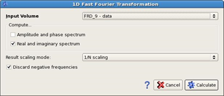

# Fast Fourier Transformation

To perform a fast Fourier Transformation please go to:

**Processing** → **Fast Fourier Transformation**

_FFT dialog_

**Compute Amplitude and phase spectrum:** two output volumes will be created for the complex spectrum, one containing the amplitude spectrum and the other one containing the phase spectrum.

**Compute real and imaginary spectrum:** two output volumes will be created for the complex spectrum, one containing the real component and the other one containing the imaginary component of the spectrum.

The **result Scaling Mode** selects with which factor the resulting spectrum will be scaled. The selection here influences the scaling mode which should be used in the Inverse FFT. The product of the scaling factors must give 1.0 for correct amplitudes after the Inverse FFT.

Reasonable combinations are:

* FFT: 1/N, Inverse FFT: No scaling
* FFT: No scaling, Inverse FFT: 1/N
* FFT: sqrt\(1/N\), Inverse FFT: sqrt\(1/N\)

If the **Discard Negative Frequencies** option is enabled, the negative frequency part of the spectrum will be discarded. It depends on the further processing of the volumes whether this negative part is needed or not.

