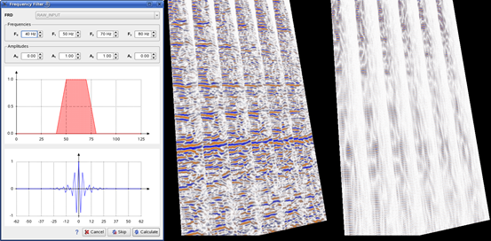

# Frequency Filter

The frequency filter offers an alternative filter design to the Butterworth filter although it is preferable to use the Butterworth filter.

Go to: **Processing** → **Frequency Filter**

By default, the algorithm parameters are set to perform low pass filtering. You can adjust the frequencies and amplitudes to your needs. Hence, it is possible to implement box, trapezoidal and irregularly shaped filters.

The **frequency filter** is used to filter certain frequencies from the given input seismic. With the four frequency selections, the user can define any trapezoidal or rectangular shaped filter \(by using F$$_0$$ = F$$_1$$ and F$$_2$$ = F$$_3$$\).

The amplitudes chosen for the selected frequencies allow the user to control the severity of the filter. The **four amplitudes A**$$_0$$ **to A**$$_3$$ correspond to the four primarily defined frequencies for this filter. The value chosen here defines how the frequency is applied from zero \(no effect, the frequency is completely blocked\) to 1 \(total effect, the frequency is fully included in the result\).

_Default settings of the frequency filter algorithm, by default set to a low pass filter_

In **the upper graph**, the red shaded area shows the shape of the filter, specified using the frequencies and amplitudes selection. All data outside will be filtered.

The **graph on the lower end** of the window displays the current filter impulse response.

_Displays the parameter settings, before and after snapshot of an intermediate passband filteringOnly signal frequencies between 40 to 80 Hz are passed._

