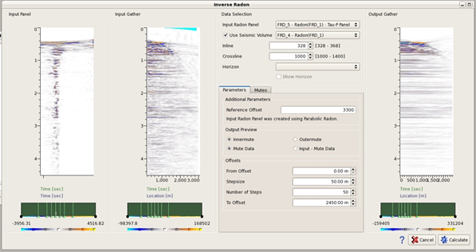
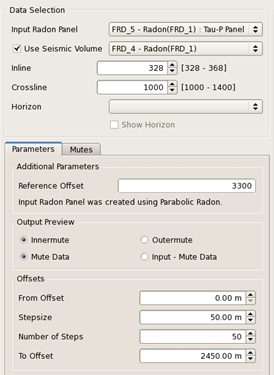

# Inverse Radon

The complete Radon process accepts a time-offset \(t-h\) input gather and generates a time-offset output gather. It consists of the steps

1. forward Radon transform from t-h to tau-p,  
2. muting the tau-p gather, followed by  
3. inverse Radon transform.

2 and 3. or only 3. can be run by launching the inverse Radon transformation.

Inverse Radon accepts tau-p gathers \(panels\) as input. They can be generated by Pre-Stack Pro 's Radon if the user activates "additional output selection: output Radon panel". [Radon](radon.md)

The window is divided into four parts \(from left to right side\):

**Part1: The radon Panel**

In this display, the radon input panel is display in Tau-p space, Left and right mutes can be applied to data.

**Part2: The input gather**

This display shows the currently selected input gather to the high resolution radon algorithm.

**Part 3: The data selection & parameters section**

_Data selection and parameters tab_

**Data selection:**

Inverse Radon detects the modus that was used for generating the tau-p gather.

If you select a Tau-p volume from the data-pull as input to this process the GUI will tell you in the field below "Reference offset" whether the tau-p panel was generated by parabolic, linear, or hyperbolic transform.

If "use seismic volume" is not activated the tau-p input is inverse transformed which directly creates the output gather.

**Parameters**

**Additional Parameters**:

To perform the inverse Radon Transformation, the initially used parameters are requires. As long as these values are not set, the algorithm cannot run:

* For linear and parabolic radon, this is the reference offset

The GUI does not detect the reference offset. This reference offset must be the same as the one that was chosen to generate the tau-p panel. You can always use “show volume history” on the volume in the Data Pool to find the reference offset. The user must fill-in the correct number here, before the preview panel can be displayed on the right hand side.

* For hyperbolic radon it is the minimum Tau value.

**Output preview:**

“Show Data Model” will display the input data with the multiples removed.

“Show Data Model Removed” will output what has been removed from the input data.

The default option "innermute" and "mute data" does the expected job if the tau-p vales of the input contained the signal one wants to preserve \(e.g. the primaries\).

If "use seismic volume" is activated one can select a cube of t-p gathers which is then displayed in the central display. The user has then the option to subtract the inversely transformed tau-p gather from the input \(i.e., assumes that the tau-p panel contains the noise/multiples\). The specification of the offset output spacing is not necessary in this case since the offset sampling of the "use seismic volume"-gather is used.

Radon followed by inverse Radon, thus, forms a workflow that can be used for offset re-mapping or trace interpolation.

