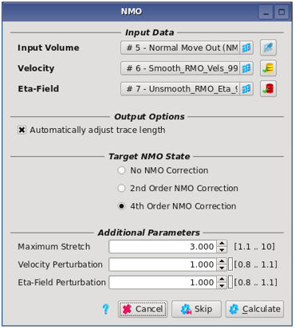
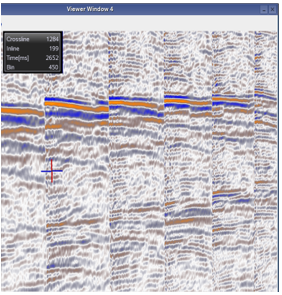
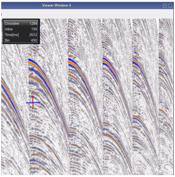

# NMO

Normal Moveout correction \(NMO\) is applied to CMP gathers to compensate for the delay in reflection arrival times with offset. The aim is to replicate the zero offset behaviour by applying a spatially varying RMS velocity function.

Pre-Stack Pro can apply and remove NMO corrections: **Processing** → **NMO**

_NMO process tab_

**Input data:**

The algorithm inputs a time domain offset gather volume. This may be uncorrected; 2nd or 4th order corrected.

An **RMS velocity model** is required with the same inline, crossline and time dimensions as the seismic gathers. The yellow icon on the right side of the selection will open the load dialog and set all parameters according to the input seismic.

An **optional Eta model** is used to add or remove 4th order correction. Similarly, this needs to have the same dimensions as the seismic. It can be loaded using the red icon.

There is an option to **automatically adjust the trace length**, which is switched on by default. This safeguard prevents truncation of the far offset traces when backing off the NMO correction. If selected, it will extend the record length when the NMO is removed, and reset the record length when the NMO is re-applied.

**Additional Parameters:**

**Target NMO state:** The NMO status of the input volume is known by the software. The NMO state options will be greyed out until a velocity field \(and Eta\) are selected. The target state must be selected to output uncorrected, 2nd or 4th order corrected gathers.

**2nd and higher order moveout correction**

The short-spread formula kinematically corrects offset-domain gathers up to small offsets.

$$
t = \sqrt{t_0^2+\frac{x^2}{V_{RMS}^2}}
$$

Here, $$t$$ denotes $$t$$-zero time and $$x$$ offset.

Moderate and large offsets are better corrected by a higher order formula. Pre-Stack Pro uses the formula derived by Alkhalifah \(1997\)

$$
t = \sqrt{t_0^2+\frac{x^2}{V_{RMS}^2}-\frac{2\eta x^4}{V_{RMS}^2(V_{RMS}^2t_0^2+(1+2\eta)x^2)}}
$$

Model parameter $$\eta$$ may be due to fine layering or due to anisotropy. As velocity $$v_RMS,\eta$$ is an effective parameter that involves averaging of the overburden.

**Maximum stretch:** Due to the $$t_0$$-dependence of the NMO formulas, wavelets stretch in time upon NMO correction has an increasing effect with smaller $$t_0$$ time and larger offset. For each $$t_0$$ time, the offset for which the stretch exceeds the given value is determined and all amplitudes are removed for larger offsets.

The **Velocity and Eta Field perturbation** can be used to over- or under-correct the gathers \(e.g. for Radon based multiple removal\). These parameters are applicable to forward and inverse NMO.

_Original data_ 

_Result of the reverse NMO_

