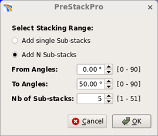

# Partial Stacking

**Processing** → **Partial Stacking**

This generates a series of stacks data from user-defined angle or offset ranges. The output could be several stack volumes or one pseudo pre-stack volume.

_Dialog for Partial Stacking_

The  icon will let you either adding a single sub-stack to the table or N sub-stacks defined by the angle range of the N stacks and the number of stacks.

The  icon is to edit an entry in the table.

_Defining a range for N sub stacks_

