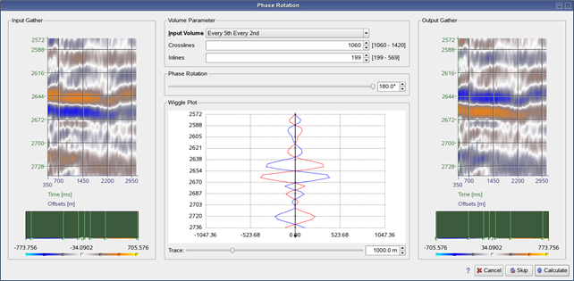

# Phase rotation

This process applies a global phase rotation to the seismic data. It can be used to match the phase of the data to that of a synthetic created at a well location. Rotation can be applied in 0.1 degree increments.

Go to: **Processing** → **Phase Rotation**

_Phase rotation dialog: phase rotation of 180deg_

**Part 1, input:**

The **Input Gather** field on the left displays the gather corresponding to the inline - crossline pair shown in the **Volume Parameter** box.

**Part 2, the parameters:**

In the central part of this dialog window, the user can select the seismic input volume as well as the inline/crossline location to see the preview at.

The **phase rotation parameter** is the most essential one and defines the actual rotation + rotation direction. The horizontal slider, or the number field on the right side end can be used to specify the rotation angle.

The **Wiggle Plot** displays the offset trace signal before \(blue\) and after \(red\) rotation.

**Part 3, the output:**

In the right most part of the window, the output resulting gather is displayed.

