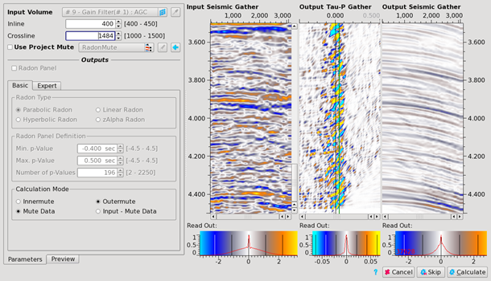
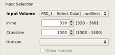
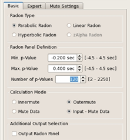
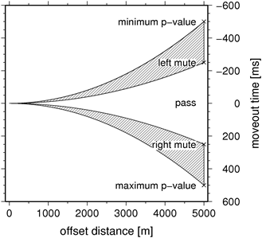
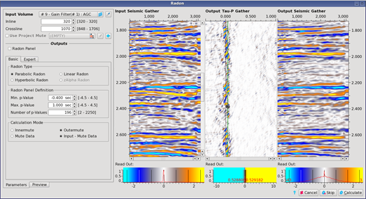
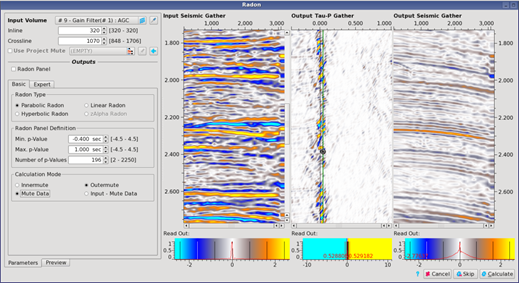
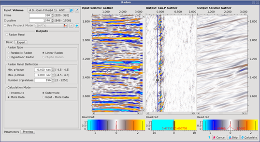
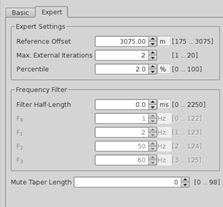

# Radon

In structurally simple areas, multiples have approximately parabolic moveout in CMP gathers after NMO correction with the primary velocities. Other types of coherent noise such as interface waves and swell noise may appear as linear events in CMP gathers. The Pre-Stack Pro Radon tool may be used to attenuate those coherent energies in CMPs if it has hyperbolic, parabolic or linear moveout.

To open the Radon dialog, go to: **Processing** → **Radon**

The window is divided into four parts \(from left to right side\):

_Radon dialog_

**Part 1: The parameters section**

The parameter section with the **Input Volume** section composed of the data volume and inline-crossline pair selection.

**The Basic tab:**

The **Settings** section which holds the Radon mode setting and the parameter fields for minimum, maximum and number of p-values.

_Graphical representation of the different parameters_

The Pre-Stack Pro Radon tool may be used to filter **linear, parabolic or hyperbolic** events.

The minimum and maximum p values are the lower and upper limits of any such events in the data. The number of p values should be set according to aliasing criterion: number of p-values ≥ 2 ∙ \(pmax – pmin\) ∙ fmax, where fmax is the maximum frequency in the data at the far offset. There is no point in making the number of p values much greater than this as it will use more runtime without improving the result. However, if the number is less it may produce artifacts because the data at the far offsets are insufficiently sampled. As a rule of thumb, 1 p value per 10 milliseconds of range is often reasonable and corresponds to a maximum frequency of 50 Hertz on the far offsets.

The user has to set the minimum, maximum p-values, the left, right mute and the number of p-values according to the character of the data.

If the Radon should aim at events inclined to the lower right:

* -use a lower minimum p-value and left mute 
* -but a bigger right mute and maximum p-value than the default one.

When changing the minimum and maximum p-value press the **Recalculate Panel** button on the bottom of the window to apply the new setting to the **Radon Panel**.

To set the left and right mute click the left mouse button + Ctrl inside the **Radon Panel**. Setting of a second or third mute is done the same way. You can move the mute by clicking the left mouse button on the mute and dragging it. Use Shift + Left mouse button to place a left mute.

Mutes can be deleted by moving the mouse over it and pressing the right mouse button, and choose **Remove control point**.

_Result of a parabolic radon_

_Data removed by a parabolic radon filter_

  
_Data removed by a liner filter_

In the **Calculation Mode** specification, you can toggle between inner, or outer mute and whether the output should be the removed multiples \(check **Show Data Model Removed**\) or the Radon filtered data \(check **Show Data Model**\).

In the **additional input section**, it is possible to output the radon panel: the radon transformed input data \(tau-p\). This separate output could be used in the [Inverse Radon Algorithm](https://github.com/sharpreflections/prestackpro-manual/tree/8bdcba1d7bdf85df36d1f4de36ef5e6a1172d09a/algorithm_documentation7processing/inverse_radon.md).

**Expert Parameters**

_Expert tab_

The Pre-Stack Pro Radon tool uses a high resolution transform developed by M. Sacchi \(Sacchi, M. D. and Ulrych, T. J., 1995, SEG Expanded Abstracts, 14, 616\). This involves a double iteration. The outer iterations control the amount of focusing or resolution in the Radon domain. The inner iterations control the accuracy of the solution. We recommend using 2 or 3 outer iterations, as more may become unstable. Increasing this parameter increases runtime. The threshold percentage is a sparseness criterion setting. Making it smaller will reduce resolution, and increasing it too far may produce artifacts.

The taper length is the number of p-values tapering across the p-mute curve. The taper is defined outward, meaning samples along the curve get a weight of 1.0

**Part2: Input Gather**

By default the whole gather is displayed.

**Part 3: Radon Panel**

This field displays the input gather with the Radon transform applied and is used to set the left and right mutes. The left and right limits of the abscissa correspond to the minimum and maximum p-value given in the **Settings** field on the right side of the window.

Make a left mouse button click into the field to set a mute. Toggle between left and right mute by clicking the right mouse button and select from the menu. You can add mute knee points by clicking the left mouse button again. It is also possible to save or load mute tables \(right mouse button menu\).

Adjustments to the color palette settings or the zoom function are similar to the **Input Gather** or **Viewer Window** settings. [Histogram ](../../viewers/old-3d-viewer/histogram_color_bar_and_transfer_function.md)

**Part 4: Output Gather**

Depending on the **Calculation Mode** setting \(center right side of window\) this field either displays the removed data \(if **Show Data Model Removed** is checked\) or the result of the Radon filter on the data \(if **Show Data Model** is checked\).

