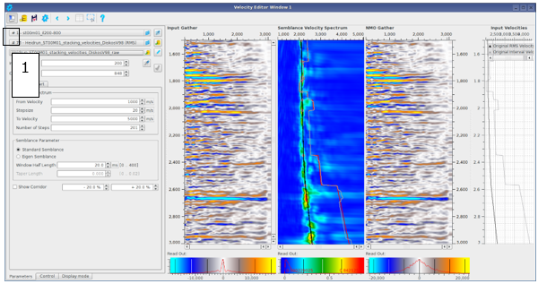

# Create Velocity Functions

The Velocity Functions object is a discrete representation of a Velocity Field. It consists of pairs \(Time, Velocity\) at one or more locations. The pairs are not necessary regularly sampled in time. Also, the functions locations are not necessary regularly spaced.

There are two ways to create Velocity Functions:

* From ASCII file: if you possess stacking velocity picks in the original ASCII format \(DISKOS for example\), you can convert them to Velocity Functions during import \(See 4.1.8.1 \)
* From a velocity volume which can be transformed into a set of Velocity Functions with a user defined geometry.

To do that, open the Velocity Editor and click on \(1\) Create Velocity Function

This window will pop-up:

Choose an input velocity volume if you have one already loaded in the Data Pool or choose to load one by clicking on 

Give a name for the Velocity Functions set.

In order to ensure fast interactive display and manipulation of the Velocity Functions object, a set cannot have more than 10 000 functions. If your selection is above this limit, the software will ask you to reduce the spacing.

**Automatic Reduction in Time:** this will do a smart sampling in time to put control points only at times where there is a change of Vrms. We recommend to tick this option on.

