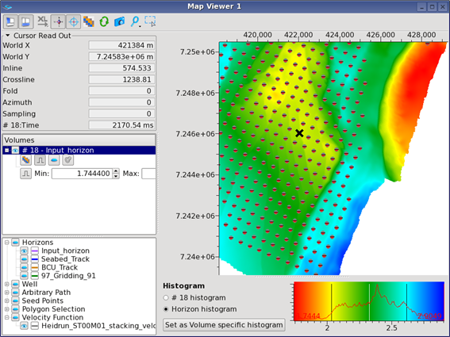
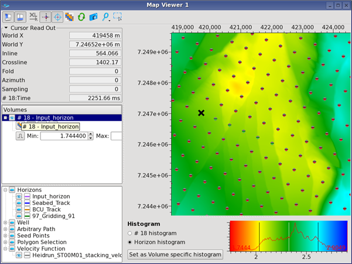
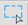

# Link to a map

A click on this icon  then double click inside a Map Viewer lets you see the current location being picked. A double click will also grab the location.

In the lower tree of the Map Viewer, Velocity Functions visibility can be turned on or off.

_A Map Viewer showing velocity functions locations.  
Note half of the circle is red showing the state of the functions._

_Some functions have a green status, meaning they have been reviewed._

The icon  for selection lets you select all velocity functions inside a rectangle and delete them or edit them \(**Manipulated All Selected Points**\). This is useful for deleting all functions inside a spatial anomaly, visible on a velocity time slice, for example.

If you choose Edit Selected Functions, you can set a constant interval velocity in a window defined by constant times and/or horizons.

