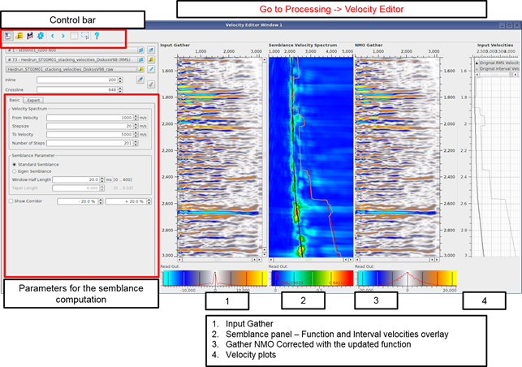
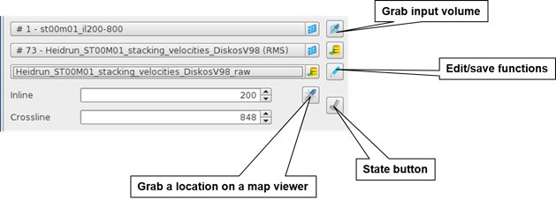

# Main window

The control bar has the following features

1. Show/Hide the left parameters panel  
2. Create Velocity Function: see above  
3. Save as a new Velocity Function: save the Velocity Functions with a new name  
4. Create Velocity Volume: outputs in the Data Pool a Velocity Volume from the current Velocity functions set. **Tip:** drag the volume into a Top or Map viewer to make a time slice of the velocity. If you modify the function and click on the button again, it will update the volume.   
5. Jump to the previous/next Function: it will go to the next/previous location within the same inline which has a function. If the current position is the first or last point in the inline, it will jump to the previous/next inline  
6. Open a table editor  
7. Select a time range to edit/delete several points in one function  
8. Tool tip: click on a parameter to show a help message

The selection area has the following features:

**Grab input volume:** choose an input volume from the Data Pool or a visible volume in any 2D Viewer. **Edit/Save functions:** switch to edit mode for the selected functions. In edit mode, this button becomes a Save \(using the same name as the input\). **State button:** This button becomes active when you are at a location that has a velocity function. Each function has three states and their color in the Map Viewer will reflect this:

* Orange: in review
* Red: not reviewed yet
* Green: reviewed

Clicking on the state button will switch the current active function from Red or Orange to Green.

**Grab a location on a map viewer:** jump to the nearest location from a double click inside the map viewer. It will also add a cross at the location currently being edited.

