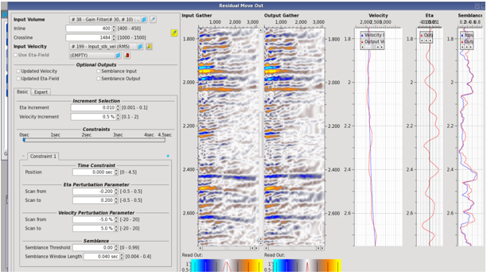

# RMO

The RMO algorithm allows you to work with time but also with depth gathers.

_Overview_

The input volume must be an offset PreStack cube and RMS velocities are mandatory. Eta field can also be specified.

For time domain data:

A scan over parameters Vrms and eta are performed to find the best model. Then the best combination of vrms and eta is selected based on maximum semblance criterion of the nmo corrected data. The higher order NMO formula \(see [NMO](nmo.md) and [stacking](stackmute/)\) is used.

The model can be QC in the different preview panels on the right part of the process tab.

_Velocity tab: Blue the input. Red the model_

In the parameters selection tab, the scan **range for perturbations of vrms** is selected as a percentage of the current velocity model and the scan range for eta.

If the parameters "Scan from" and "Scan to" are both set to zero, it disables scanning.

If specified, the eta values inside the eta scan range are added to the current eta values; otherwise, the eta values are summed to eta = 0. Thus, the eta values are directly taken as test eta values.

-**Semblance threshold:** Optimum velocity and eta values are computed for all time samples. Afterwards, time samples of semblance maxima are determined and the optimum velocity and eta values fixed at these locations while values between these maxima are interpolated. A semblance maximum is only treated as such if the semblance is larger than THIS semblance threshold

-**Window length:** total length of depth window for semblance calculation

A constraint is defined by the ensemble of: scanning parameters, Semblance Threshold and Window length. It is possible to defined several constrains, each one starting at a different time. The start time is defined by the parameter **Position**.

**Stencil selection:**

If the inline and crossline length are left at 0, the best vrms and eta values at an inline/crossline location are determined by optimizing the semblance of the gather at this location. For a better lateral continuity, the best semblance may be determined by optimizing the combined semblance of this central gather and its neighbours according to the vicinity defined by inline/crossline half length.

**Outputs:**

In addition of a new data set of gathers RMO corrected, additional volumes can be created such as the updated Eta field and velocities or the semblance input or output cubes.

**For depth domain data:**

For depth domain data depths at offset 0 are changed for changing vrms. The current methodology only allows to update vrms while no update for eta is provided.

The horizontal domain can be offset or local angle of incidence.

According to the change of velocity model the depth positioning of the velocity model and of the seismic need to be corrected - unlike for time domain RMO correction. Therefore, it is important to run through the following procedure where superscript k refers to iteration number:

* Transform the current slowness model $$S^k$$ and the error $$\rho$$ from depth to time using the current $$S^k$$. 
* Transform the current interval velocity function $$1/S^k$$ into an $$RMS$$ velocity function $$V^k_{RMS}$$ 
* Compute new $$RMS$$-velocity function by $$V_{RMS}^{k+1}(t) = V_{RMS}^k(t)/\rho (t)$$
* Convert $$V_{RMS}^{k+1}$$ to interval velocities by Dix inversion to get $$S^{k+1}$$. 
* Convert the new interval slowness back to depth using $$S^{k+1}$$ slownesses.
* Also, convert the RMO corrected gathers from depth to time using $$S^k$$ and then convert back to depth using $$S^{k+1}$$.

The scanning range for rho needs to be specified.

