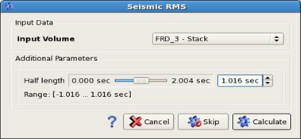

# Seismic RMS amplitude calculation

To calculate the seismic RMS amplitude, please go to **Processing** → **seismic RMS**. The following window will open:

_Seismic RMS dialog_

This algorithm simply uses the user defined window as a sliding window over all traces in the input volume and calculates the root mean square within this window.

The result of the calculation is put into the output volume at the location of the center of the window.

The result will contain RMS values over the given window in each sample.

This result is the same that AGC in the Gain Filter delivers, when you enable the output of the RMS values. [Gain filter](gaining.md)

