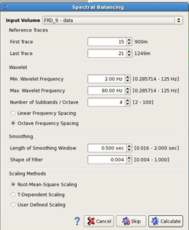
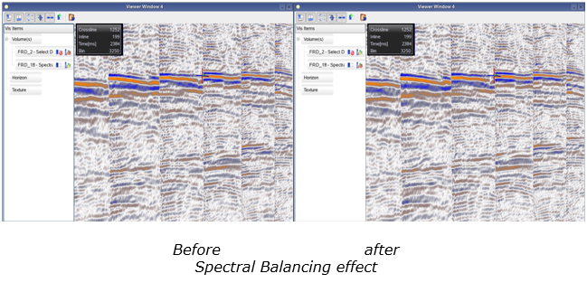

# Spectral Balance

Spectral balancing makes seismic wavelets more consistent over the offset range by balancing the amplitude distribution with frequencies of the signal. Hence, it is possible to sharpen events by boosting high frequency energy at far offsets.

To apply spectral balancing go to:  **Processing** → **Spectral Balance**

  
_Spectral balance dialog_

Spectral balancing is based on a time – frequency decomposition obtained by convolving the data with a series of operators. Each operator is the product of a Gaussian with a cosine function. The spectrum of the individual trace is matched to a reference \(stacked\) trace, so that the bandwidth is consistent with the reference trace.

The input volume must be pre-stack data.

**The reference traces** are a selection of the range of traces to be used as reference traces. In most cases, near offset traces are a good choice. The default offset range defines the reference trace in the middle of the gather. The result will compress the longer periods on the far offsets and will stretch the shorter periods on the near offsets.

There are two options available defining the frequency sampling density:

* Linear frequency spacing will split the frequency range with a constant increment
* Octave frequency spacing will split the frequency range into pieces \(sub band\) increasing exponentially. The range between minimum and maximum frequency is filled by doubling the frequency at each step \(e.g. 8Hz, 16Hz, 32Hz, 64Hz and 80Hz\) and gaps will be filled by a    logarithmically distributed number of sub bands. We recommend to use    this option.

**Wavelet:**

**Min/max wavelet frequency** defines the frequency range on which the Gabor Transformation is applied. For an acquisition frequency of 50Hz, a range of 8Hz-80Hz is a good start.

**Number of sub bands/octave** defines the number of sub bands \(pieces\) per octave the frequency range will be split into.

**Smoothing:**

The **Length of Smoothing Window** option defines the length of the filter applied to the ratio of \(reference-trace energy in sub band n\)/\(reference-trace mean total energy\).

This filter should be as narrow as possible: this window size should be as small as possible.

The **Shape of Filter** parameter is an exponent similar to the standard deviation \(that controls the decay rate of the Gaussian normal distribution\). Small values will lead to very sharp shape of the filter. We recommend leaving it at the default value.

**Scaling Methods:**

* **-Root Mean Square Scaling:** the RMS of each trace before and after balancing is the same.
* **-T Dependent Scaling:** this option will preserve the energy of any time sample. The energy of the unbalanced and balanced trace is equal at any time sample.
* **-User Defined Scaling:** the user defines a percentage used to scale all traces, the clip percentage. 

