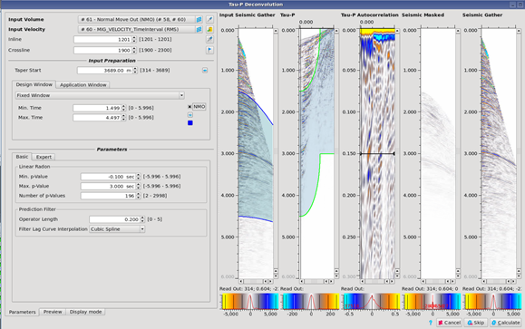
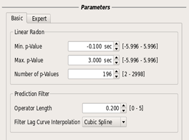
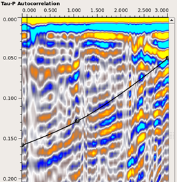
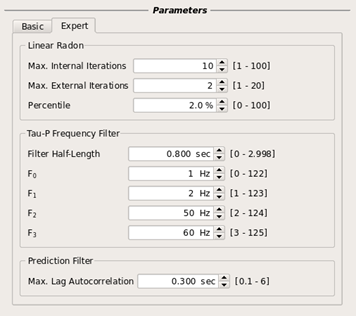

# Tau-P Deconvolution

Predictive deconvolution can be applied in the Tau-P domain to suppress periodic multiples.

The Pre-Stack Pro algorithm converts non-NMO corrected CMP gathers into the tau-P domain, before applying predictive, gapped deconvolution. The output is converted back into the t-x domain.

To open up the tau-p deconvolution dialog go to: **Processing** → **Tau-P Deconvolution**

_Tau-P Deconvolution_

Strong events, such as the BCU, often generate stubborn multiple reflections. In Pre-Stack Pro, the primaries can be incorporated into a design window, whilst the multiples can be targeted within a separate application window.

Three options are available for defining the windows:

* A fixed window that is spatially consistent 
* A window centered about a single horizon
* A window that is defined between two horizons 

When using the horizon options, it’s necessary to make sure that there are no holes within the processing area, otherwise a warning message will be issued. Also, there must be sufficient separation between two horizons to produce a sensible result.

If the check-box NMO is toggled on, the window time in the offset direction follow the NMO curve based on an input RMS velocity volume.

Tau-P deconvolution can be applied with a taper in the offset direction, so that the fars are left untouched. This can be useful when used in combination with parabolic Radon; specifically, when the Radon gives a good result on the far offsets, but struggles to differentiate between primary and multiple on the nears.

**The Basic tab:**

The user will need to set the operator length, time lag curve, and p-value parameters according to the character of the data.

_Tau-P Deconvolution – Basic Tab and Time Lag Curve_

The operator length is the active part of the operator. It is shifted down to the start of the first multiple with the time lag curve \(or gap\). This is picked on the auto-correlation panel using either linear fit or cubic spline interpolation.

The user must create a suitable time lag function, which follows the multiple trend in the data:

* Use the left mouse button to drag control points.
* Use shift + left mouse button to move the whole time lag curve.
* Add additional points by clicking on the curve → Ctrl + left mouse button
* Remove them again by right clicking → delete control point

The minimum and maximum p values define the limits in tau-p space. The number of p values should be set according to aliasing criterion: number of p-values ≥ 2 ∙ \(pmax – pmin\) ∙ fmax, where fmax is the maximum frequency in the data at the far offset.

If the number is less than this, then it may produce artifacts, because the data is insufficiently sampled at the far offsets. On the other hand, it’s not advisable to make the number of p values too large, as this will use more runtime without improving the result.

As a rule of thumb, 1 p value per 10 milliseconds of range is often reasonable and corresponds to a maximum frequency of 50 Hertz on the far offsets.

**The Expert tab:**

_Tau-P Deconvolution – Expert Tab_

A tau-p frequency filter can be applied on the mute data in tau-direction, although it is switched off by default. It can be activated by choosing a filter half-length greater than 0.

The max lag autocorrelation sets the length of the autocorrelation window. In general, it should not be necessary to increase this from the default of 0.3 seconds.

The external iterations control the amount of focusing or resolution in the tau-p domain. The inner iterations control the accuracy of the solution. We recommend using 2 or 3 external iterations, as more may become unstable. The number of inner iterations can generally be set between 10 and 30. Increasing either of these parameters will slow down the runtime.

The percentile parameter is a sparseness criterion setting. Making it smaller will reduce resolution, and increasing it too far may produce artifacts.

