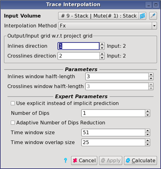

# Trace Interpolation

Go to **Processing** → **Trace Interpolation**

The input must be a stack volume. The algorithm is used to perform a regular interpolation of traces in inline and/or crossline direction. Typically gathers data have an inline spacing of 25 meters while stack data have inline spacing of 12.5 meters. Trace Interpolation will interpolate one trace out of two to half the inline spacing. The numbering of the axe to interpolate must be greater than 1.

The algorithm is supported in workflows.

_GUI for Trace Interpolation_

**Interpolation method:** Linear, Sinc and Fx interpolation are the possible choices. Note that Fx method does not allow interpolation, in both inline and crossline direction, in one run. If you wish to do so, please run two passes of interpolation sequentially in each direction or use the Sinc method.

**Output/Input w.r.t project grid:** this parameter is the final increment for both axes. If the data has an inline spacing of 25 meters and an inline increment of 2, entering 1 in the inline direction will interpolate to a 12.5 meters inline spacing.

**Window half-lengths:** define the size of the filter used. High-values may lead to dip aliasing.

Expert parameters are used only if the interpolation method chosen is Fx.

**Use explicit instead of implicit prediction:** the default implementation uses two systems of linear equations. If explicit is ticked on, it will replace this by one system and an extrapolation step, increasing the run-time speed. The results need to be checked as this method has its own artefacts.

**Number of dips:** the F-X interpolation method is based on fitting a number of linear dips to the traces. A bigger number might improve the results but also lead to an increase in run-time.

**Adaptive number of dip reduction:** in case of matrix inversion issues, the algorithm can automatically reduce the number of dips used. This may significantly increase the run time.

**Time Window size:** split the traces into vertical windows of this size, given in samples.

**Time window overlap size:** overlap in samples of the time window. A value of 25% to 50% of the window size is recommended.

