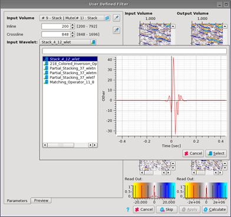
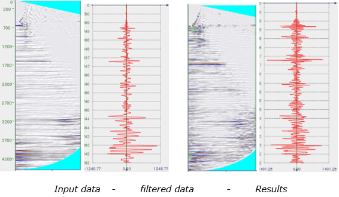

# User Defined Filter

The user defined option allows the import of an ASCII file defined filter type. Then apply this filter to your selected volumes.

Go to: **Processing** → **User Defined Filter.**

_User Defined Filter_

The first part is the **Input selection**. The input volume to filter is selected here. In the input ASCII file, the filter can be selected. It must be pairs of time/depth and scalar. This filter will be applied to the input volume using convolution.

The **second part** of the window is a preview of the ASCII filter.

In the **column specification** part, the content of each column in the input file needs to be specified. One column must have the **time** information \(either in seconds or milliseconds\) and the other column the actual **scalar** value.

