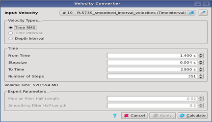

# Velocity Conversion

In addition to the on-the-fly conversion done during velocity selection \(Velocity\) you can also convert velocities between different domains via **Processing** → **Velocity Conversion**. This algorithm is compatible with workflows.

Possible domains are time interval, time RMS and depth interval.

_Velocity conversion GUI_

Conversion from time interval to time RMS is done via the following formula:

$$
V_{rms}^{(n)} = \sqrt{\frac{\sum _{i=1}^nV_i^2t_i}{\sum _{i=1}^nt_i}}
$$

Where $$V_i$$ is the time interval velocity of the $$i^{th}$$ layer.

**Inverse conversion from RMS to time interval** properties is done via **Dix’s equation** \(plane layer assumption\). This equation requires some regularization to avoid spikes in the output volume. **Expert parameters** correspond to the time window half-lengths in milliseconds for the median filter and smoothing filter applied to the input volume.

**Stretch between time and depth** interval velocities is done using the following relations:

$$
z = \int_0^tV(t)dt
$$

$$
t = \int_0^z\frac{dz}{V(z)}
$$

