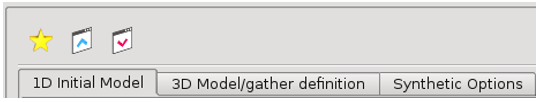

# 3D Model/Gather analysis

In this example, the amplitude changes from a peak to a trough \( yellow to blue \) when brine is replaced with gas.

The polarity reversal location, shown by the zero amplitude white band, occurs with less % gas as porosity decreases, and the rock becomes weaker and more unconsolidated. Synthetic gathers from the 3D parametric volume are shown in the Data Comparator, below \( Points of interest \(POI\) 1 – 4 \) 

Looking at the $$V_p$$, $$V_s$$ and density volumes used for the model, we can see how the Gassmann fluid substitution, from brine to gas, has altered the $$V_p$$ much more than the $$V_s$$ or the Density. $$V_s$$ is only slightly affected by the change in density – decreasing density = increasing $$V_s$$. The gas changes $$V_p$$ very quickly with low porosity, because the constant in situ $$V_p$$ → a softer rock.

_Top View -_ $$V_p$$_,_ $$V_s$$ _and density timeslices, for top reservoir_

$$V_p$$, $$V_s$$ and Density volumes, were output from the modeling, using the create volumes option above.

**Synthetic options:**

Select the $$3^{rd}$$ Tab

 This Tab can be used to select a wavelet for all the synthetic gathers; a method for calculating AVO amplitudes and any runtime parameters. It also has a wavelet scaling option and an overburden definition table if required.

**Model save & rerun:**

The last model definition is automatically saved by the application, but as soon as a new model is defined or this ‘active model’ updated it will be overwritten and lost. Therefore, it is really important to save the output model to the project disk as a .m3d file using the save \(red\) ‘V’ icon.

So that it can be restored using the \(blue\) inverted ‘V’ icon later:

Any $$V_p$$,$$V_s$$, Rho model logs themselves, can be saved to a project well, once they are displayed in the Model Log Viewer, by Save logs to project.

Also, entire $$V_p$$, $$V_s$$ and Rho input 3D volumes can be saved to the project, from the data pool, once the model has been calculated – so long as they have been selected for output as shown below.

