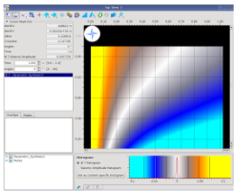

# 3D Model/Gather definition

All synthetic gathers have an angle or offset ‘X’ dimension to which the user can add an inline and a crossline dimension to create 2D and 3D gather volumes. A $$2_{nd}$$ gather ‘Y’ offset can also be added to make a final model with 3 parametric axes.

Layer parameters which can be assigned to inline, crossline or $$2_{nd}$$ offset include : All Layers : thickness, $$V_p$$, $$V_s$$, Rho, $$V_p$$/$$V_s$$, AI

* Reservoir Layers : In situ Porosity, % hydrocarbon & Kmin.
* Reservoir Layers : Target Porosity.

Only 1 layer & 1 of its parameters can be assigned to any axis. However, any layer can be assigned to any axis. So valid layer and parameter combinations include :

* 2D model :  Inline = Target &  Thickness; 
* 3D model :  Inline = Target &  AI;  Xline = Caprock &  AI;
* 3D model :  Inline = Target &  $$V_p$$;  Xline = Caprock &  $$V_p$$/$$V_s$$;
* 3D model :  Inline = Target &  In situ Porosity; Xline = Target &  % gas;

The model time range is set by adding 300 msec to model Tmin and Tmax and the sample rate is 1 msec; unless changed by the user.

The model inline & crossline numbers, range and inc are set by the axes input parameter ranges. These will not have any project X/Y map coordinates and so any timeslice or map extracted from these models

will need to be displayed in a Top View. This image shows a Top View - $$0^o$$ angle of incidence, amplitude time slice, for top reservoir. Horizontal axis = 0% to 100% gas Vertical axis = 15% to 25% $$\Phi$$, in situ porosity

**3D Model/gather definition** 

Select the $$2^{nd}$$ Tab

In the example below, the inline axis is set to be the target layer hydrocarbon % and crossline, the target layer in situ porosity.

 

The Parametric Axes box, on the left hand side, allows the user to choose a property to assign to an axis – the list of properties above includes in situ porosity, Kmin & Hydrocarbon %, only if the layer selected is a reservoir layer.

The Output gather box on the right, gives the offset/angle gather dimensions that will be output into the synthetic model volume.

The user can choose whether to output the $$V_p$$, $$V_s$$ and density 3D stack volumes for Q.C. and also to review the model output size and reduce it’s dimensions if needed. \( 9 x 76 x 1 x 8 x 1001 \)

