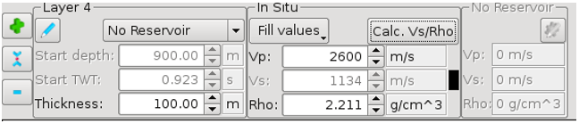
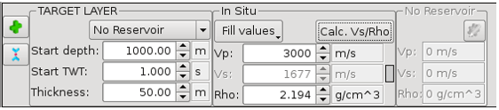
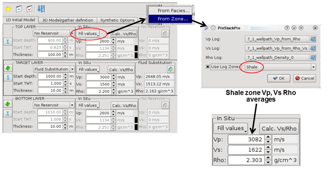
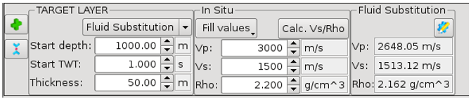
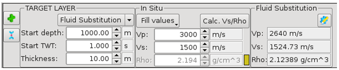
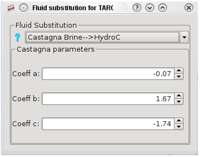
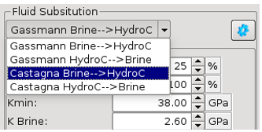
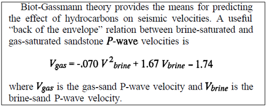
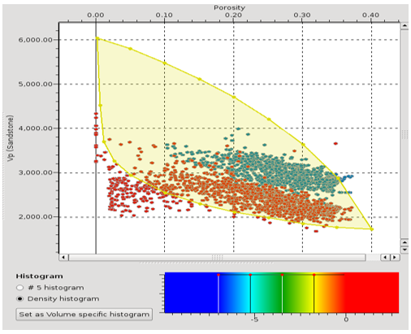

# Initial 1D Model

Creates an initial or reference model, a $$V_p$$, $$V_s$$ and density log, from which a 2D line or 3D gather volumes can be created.

These logs are made from at least 3 user defined layers - Top, Target and Bottom layers, plus any added in-between.

The **Target layer** has a fixed top depth \(MD\) and associated time \(TWT\), which acts as a model reference datum, from which the model is built. All the layers have a thickness to define their top and base relative to this

Layer properties can be defined as follows:

* $$V_p$$, $$V_s$$, Rho by manual entry of values, 
* $$V_p$$ by manual entry, $$V_s$$, Rho by Castagna and Gardner equations
* $$V_p$$, $$V_s$$, Rho by well facies or zone, averages
* $$V_p$$, $$V_s$$, Rho by **«Reservoir»** Gassmann fluid substitution
* $$V_p$$, $$V_s$$, Rho by **«Reservoir»** Castagna fluid substitution
* $$V_p$$, $$V_s$$, Rho by **«Reservoir»** Porosity change

Gradual / sloping layer changes can be modelled using the Add intermediate layers option.

This initial or reference model, gives to 2D/3D models :

* -all layer thicknesses; all layer properties; and 
* -all reservoir layer,  fluid substitution parameters, 

  \(which aren’t replaced later by an axis \)

* -all layer ‘In situ’ Vp, Vs and Density.

**1D initial model setup** 

To open up the 3D Parametric Synthetic Model Builder dialog go to:

**Interpretation-Processing** → **3D Parametric Synthetic Model…**

and select the $$1^{st}$$ Tab.

If any models have been created before in Pre-Stack Pro, it will use the last model’s parameters to open the GUI. So, you may need to delete some layers using the blue – icon rather than adding layers using the green + icon; or start a new model. Gradual / sloping layer changes can be modelled using the green +  option also.

Target, Top and Bottom layers can’t be deleted but are the same as ordinary layers otherwise.

**Ordinary layer GUI**

\( The black flag indicates this layer is a shale for Vs calc by equation \) First go to the target layer and set its top depth \(MD\) and corresponding time \(TWT\). This becomes a fixed depth/time value for the model reference datum.

_Target layer GUI – model reference datum = 1000m/1.0sec \( This layer is selected for fluid substitution \)_

Set thicknesses for all the layers, and then decide which layers are reservoir rocks and will need fluid substitution. The target layer above, has fluid substitution enabled by selection of the ‘Reservoir’ option - the right hand ‘Fluid substituted’ $$V_p$$, $$V_s$$ and Rho values are now set as the layer properties

**1D layer properties definition :**

**Ordinary** layers can have their $$V_p$$/$$V_s$$/Rho values entered manually, input from well log zone or PCube facies averages, or calculated by equation.

**Reservoir** layers have the extra option to calculate $$V_p$$/$$V_s$$/Rho by **fluid substitution**: Gassmann equation or Castagna coefficients methods; or by **porosity change** curves

_A Target layer with in situ Vs calculated using Castagna equation \( This equation uses custom coeffs. so a grey lithology flag is shown \)_

_A Target layer with in situ Vs and Rho calculated using sand equations_

In the example above, the greyed out $$V_s$$ and Rho values \(1557 & 2.194\) are those calculated by the Castagna and Gardner equations, from the input $$V_p$$ of 3000m/s. These equations use the coefficients set for the layer, which can be changed using the  box. The user has the choice of selecting Preset default coefficients by lithology \(Sandstone, Shale, Limestone or Dolomite\), or manually inputting their own field/rock specific coefficients, for $$V_s$$ and Rho calculations.

**Selecting Castagna and Gardner coefficients**

$$V_p$$/$$V_s$$/Rho values can also be defined by PCube facies or by well log zone, using the ‘Fill Properties’ option. Select a PCube facies, which already has averages calculated, or a log zone and calculate averages from well logs. \(Log zones can be defined by a cascade of filters in the Well Log Viewer\).

In the example below, the Top layer in the 1D model has $$V_p$$/$$V_s$$/Rho values defined by the parent well’s ‘Shale’ zone. Averages are calculated from each of the 3 input logs.

$$V_p$$_/_$$V_s$$_/Rho values from well log ‘Zone’ averages_

**1D layer properties – fluid substitution** 

**Reservoir** layers can have their $$V_p$$/$$V_s$$/Rho calculated by **fluid substitution**. In situ values are input into the middle column, and substituted results are automatically output into the right column.

 

**Fluid substitution, Gassmann input parameters**

 

**Fluid substitution, Castagna input parameters**

**Gassmann** equation fluid substitution of an in situ rock, of a known in situ porosity, or the simpler **Castagna** ‘rule of thumb’ fluid substitution equation, relating the $$V_p$$ of gas and brine sandstone; are the choices available from a drop-down menu. For both methods, the user can substitute hydrocarbons to brine, or brine to hydrocarbons.

_Fluid substitution, selection of Brine to HydroC or HydroC to Brine_

The **Gassmann method**

The Gassmann method can be used to replace one fluid by another, usually hydrocarbons with brine, or brine with hydrocarbons. Defaults were chosen to model the biggest change in $$V_p$$/$$V_s$$/Rho; the gas/brine case, but with appropriate before/after fluid parameter choices the effect of oil/brine or gas/oil substitution can also be estimated. This method requires a knowledge of both bulk modulii and densities for the two fluid phases, so that the appropriate delta/change input values can be calculated.

* Requires inputs of rock **InSitu Porosity**, **HydroC-Percentage** \(Hydrocarbon percentage\) and  **K-min** \(mineral bulk modulus\).
* Requires inputs of fluid K: **K-Brine & K-HydroC** \(giving a change of fluid bulk modulus\) and fluid Density: **Rho-Brine & Rho-HydroC** \(giving a change of fluid density\). 
* Requires an **in situ Vp**, **Vs** and **Rho**. 
* Input defaults: 

  for Brine/Gas, and a pure Sandstone reservoir:

  **K-min** \(quartz\) = 38 Gpa, **K-Brine** = 2.60 Gpa and **K-HydroC** = 0.20 Gpa; **Rho-Brine** = 1.05 g/cm^3 and **Rho-HydroC** = 0.10 g/cm^3

**Input parameter usage:**

The **K-min** default is for a pure sandstone case. If the user wants to model a sandstone/shale mix then a lower value of **K-min** could be used. This value could come from some kind of mixing of  **K\(sandstone\)** & **K\(shale\)** such as the **Voight-Reuss-Hill** averaging.

**InSitu Porosity \(**$$\Phi$$**\)** must be a reasonable value for the rock $$V_p$$, $$V_s$$ and Rho or the calculation will return suspect fluid substituted $$V_p$$/$$V_s$$/Rho values, because the rock has to be too stiff or too unconsolidated, given the in situ porosity selected. There is no lower limit cut off applied nor an upper limit of critical porosity \(40% for sand\) inside this release of the 3D Parametric Synthetic model Builder.

**The Castagna method \(gas & brine only\)**

The Castagna method can be used to replace gas with brine, or brine with gas, using the quadratic equation relating $$V_p$$**\(gas\)** to $$V_p$$**\(brine\)** and the coefficients shown below.

**The Castagna ‘rule of thumb’ fluid substitution equation**

\(Petrophysical imaging using AVO – The Leading Edge, 3/1993, JP Castagna\)

* This **Castagna equation** method only requires input of an **in situ** $$V_p$$ value from which an equivalent gas or brine $$V_p$$ is calculated.
* If a different quadratic equation has been found to work for gas/brine fluid substitution, or allows oil/brine or gas/oil fluid substitution, in your reservoir, the coefficients can be changed to use this instead.

**Example** - sandstone Brine-to-Gas:

**Gassmann** - all 3 properties change An in situ layer of pure sand \(default case\), with a **porosity** of **20**%, filled with brine, which has the properties: $$V_p$$ **=3000**m/s, $$V_s$$ **= 1500**m/s, **Rho = 2.2** g/cm^3, after gas injection, changes to a layer filled with **20**% gas, **80**% Brine which has the properties: $$V_p$$ =2648m/s, $$V_s$$ = 1513m/s, Rho = 2.162 g/cm^3

**Castagna** - only Vp changes An in situ layer of pure sand, porosity filled with brine, which has the property : $$V_p$$ **=3000**m/s, changes to a layer filled with gas, which has the property : $$V_p$$ =2640m/s,

\( The other layer properties sent back to the main table are : Rho = **2.124** g/cm^3 calculated by the Gardner equation, from $$V_p$$ 2640m/s \) and $$V_s$$ = **1525**m/s, calculated using the Rho above from Gardner and a mu from the original in situ $$V_s$$.

Castagna fluid substitution is much simpler, but is useful for just giving a feel for what happens when you put in a lighter fluid.

Well log crossplots, with useful rock physics curve overlays, can help with in situ porosity selection. In the example below, log points fall below the polygon pure sand minimum because they come from a mix of sand and shale/clay.

Cross plot of $$\Phi$$ \(porosity\) v $$V_p$$ , showing a brine sand \(blue\) and a gas sand \(red\) in relation to a polygon defining the **min** and **max** $$V_p$$ for a pure sand. \(The minimum $$V_p$$ is where the rock breaks up and becomes a suspension; the maximum is where the rock is fully cemented and as stiff as it can be\).

**1D layer properties – porosity change** 

**Reservoir** layers can also have their $$V_p$$/$$V_s$$/Rho calculated by **porosity change**. In situ values are input into the middle column, and changed results are automatically output into the right column.

_Porosity change, 20% to 25%_

_Porosity change, input parameters_

**Inputs:** in situ and target porosity, % of cementation & sorting $$V_p$$ and $$V_s$$ V porosity, upper and lower bound, RPM curves 1. Hashin-Shtrikman critical porosity upper bound \( yellow curve below = cementing trend \) 2. Hashin-Shtrikman, lower bound \( blue curve below = sorting trend \)

$$V_p$$ **v Porosity, upper & lower bound curves**

These are the curves for pure sand. They can’t be changed in this first version of the software.

Predicted porosity change, $$\Delta V_p$$ , $$\Delta V_s$$ , comes from a mix of these curves. Eg: the red dashed line = 40% cementation and 60% sorting.

Both curves start from a sand with a little bit of cementation, $$V_p$$, $$V_s$$ initial values calculated using the contact cement model equations.

**Outputs**

* New $$V_p$$ & $$V_s$$  -  calculated from In situ $$V_p$$ & $$V_s$$  +  $$\Delta V_p$$ , $$\Delta V_s$$  from mixed RPM curves,e.g. \(0.4  _cement + 0.6_  sorting curves \)
* New Rho - calculated from In situ Rho + $$\Delta Rho$$ - from a mix of Quartz \(2.65\) and fluid density \(1.07\)eg: \(0.05  _Fluid - 0.05_  Quartz \)  for a change 20% -&gt; 25%

**Example -** sandstone 20%-to-25% porosity change:

An in situ layer of pure sand, with a starting **porosity** of **20**%, filled with brine, which has the properties : $$V_p$$ **=3000**m/s, $$V_s$$ **= 1800**m/s, **Rho = 2.13** g/cm^3, after a porosity change to **25**%, changes to a layer which has the properties : $$V_p$$ =2733m/s, $$V_s$$ = 1566m/s, Rho = 2.051 g/cm^3 \( see red triangles inside the $$V_p$$ v Porosity crossplot \)

