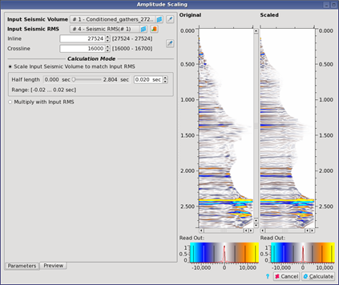

# AVO Scaling

For each synthetic gather with well log information, a separate scalar gather can be calculated.

If there's only one synthetic gather, the resulting scalars should be saved with the project after generation in the [MultiWell Scalar algorithm](multi-well_scalar.md) and can then be used directly in the AVO Scaling.

For more than one synthetic gather, the resulting scalar gathers have to be exported as SEG-Y.

After all gathers have been created and exported, they can be brought back using the import SEG-Y algorithm taking all SEG-Y files at once, marking the content as SRMS and then be used in AVO Scaling.

Go to: **Interpretation Processing** → **AVO Scaling**

_AVO scaling process overview_

**Left part of the window:**

The top of the parameter section in the middle of the dialog window holds the **Data Selection** and shows the inline-crossline pair numbers of the gather displayed in the **Input** and **Output Gather** fields.

The scalars are given as a Seismic RMS volume with the same dimensions as the input seismic. This volume can be loaded in the correct size, using the special loading button. This scalar cube can be created in the [MultiWell Scalar process](multi-well_scalar.md).

In the **additional parameters**, there are two ways to scale the given input volume:

* **-RMS Scalar** will calculate the RMS of the input seismic within the given window and scale the seismic using the given RMS and the calculated RMS.
* **-Multiplication** is used to multiply given scalars \(created using the Multi-Well Scalar tool\) with the input seismic for scaling.

**Right part of the window:**

The Input Gather displaying the gather corresponding to the inline- crossline pair noted in the Data Selection at the top-center of the dialog

The Output Gather field is used to map what part of the distance offset range will be present in the angle offset bins. Mapping can be adjusted using the Select Preview Output options.

