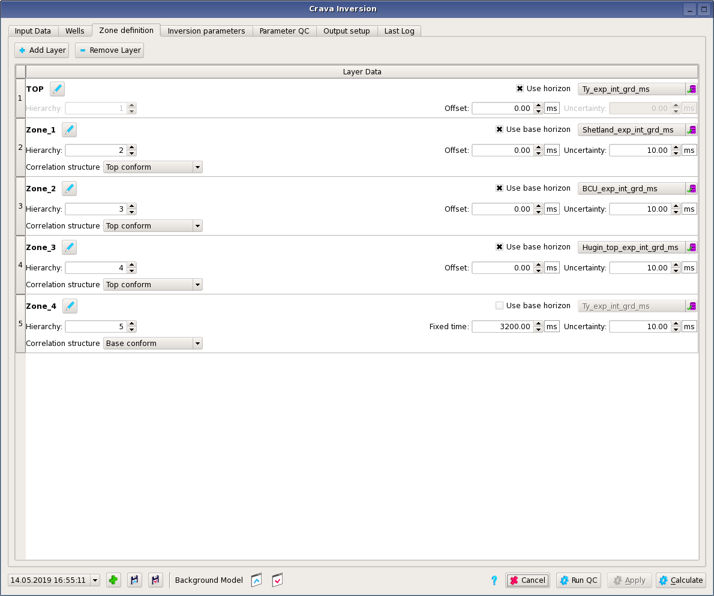
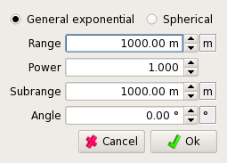

# CRAVA Inversion

This algorithm is the inversion module . A suitable background model and the input seismic must be in the Data Pool to run the inversion. The algorithm is divided into the following tabs:

* Input data
* Wells
* Zone definition
* Inversion parameters
* Parameter QC
* Output setup
* Last log

The sections below will describe each tab in detail.

## Input data

The user can select each of the acoustic volumes he uses, as well as the seismic data. The seismic data can be a stack or pre-stack volume, it must have one or more angle of incidence values defined. All four volumes must be of the same size. This defines the size of the inversion area.

For each angle value of the seismic data, the user need to set the S/N Ratio, the Wavelet to use and the scalar to apply. The S/N Ratio and Scalar can be auto-evaluated in the Inversion Parameters tab. Note that we define the signal to noise ratio as the data variance divided by the error variance, where the data variance is model variance plus error variance.

## Wells

This tab is the same as in [CRAVA Background Model](crava-inversion.md#well-data-input-in-crava-background-model-builder). The user can choose the same or different wells than the one used to compute the background model.

## Zone definition

This tab is the same as in [CRAVA Background Model](crava-inversion.md#zone-definition). The user can choose the same or a different zone definition than the one used to compute the background model. 

For easier setup of the wells and zone definition tab, it is possible to load a saved background model parameter definition. This will fill all parameters common to both the background model computation and the inversion run. The common set of parameters can also be saved from the CRAVA inversion user interface. 

## Inversion parameters

### Covariances

As shown in [Theory](theory.md#statistical-model) the prior covariance structure for the elastic parameters consists of three parts: 

1. A 3x3 covariance matrix for point-wise covariance between the parameters.
2. A temporal correlation vector, length equal to number of layers in grid, $$n_t$$
3. A lateral correlation structure.

By default, the two first are estimated from well data, and the lateral correlation structure is set to a isotropic exponential variogram with range 1000. The reason for the latter choice is that this is hard to estimate, see [Implementation](implementation.md#covariance) for details. The most common to override is the lateral correlation, where the variogram used for petro-physical modelling is a good choice. This is done by pressing **Set 2D Variogram** and entering the variogram parameters.

The full covariance structure is a 3D object where the 3\*3 covariance matrix is defined for every sample of the zone definitions. If the user tick on _Update Corrrelations_ and click on _Estimate_ in the **Parameter estimation** section, the full covariance structure is estimated. The previews update with the correlation value as a function of Time for all wells as well as the residual logarithms of the well data.

In **Statisticals parameters**, the following three choices are available:

* _Use estimated correlations_ : use the full covariance structure computed buy clicking _Estimate._
* _Load Auto Covariances_ : load a previously saved full covariance structure \(the button to save is beside the loading menu\). This is useful for inverting a small swath containing less wells than what is used to compute an optimum covariance structure. 
* _Enter Parameter Correlation_ : manually override the 3\*3 covariance matrix and the temporal correlation range. 

### Frequency parameters

The user can set the frequency band used for the inversion. 

### Parameter estimation

The user needs to define a time window used for the estimation. By default the whole log length will be used. Windows can be saved and loaded.

Wavelet parameters can be estimated, those are off by default. If they are ticked on, once the user click **Estimate**, the relevant parameters in the tab [Input data](crava-inversion-1.md#input-data) will update. 

### Set Expert Parameters

Well logs are often faulty, and CRAVA has some safety mechanisms to detect this. The primary mechanism is to detect extreme values, and set these undefined. The default upper and lower bounds accepted in well logs are set in the expert parameters. These can be overridden. 

Some logs may stay within reasonable values, but have too much or too little variation, also indicating that something is wrong. We therefore calculate the variance of the logarithm of the log minus the background, and if this is outside reasonable bounds, an error is triggered. Those bounds can also be overridden.

## Saving/Loading Parameters sets

The entire set of parameters can be saved and loaded  with the relevant buttons at the bottom left of the window.  

## Parameter QC

The user needs to define the subset to use for QC. It can be a box around a well path or a user defined box. The group **QC display settings** defines the log to be displayed as well as the parameters used for the seismic synthetic computation. 

There are two tabs on the left to either do a **Well QC** or a **Seismic QC.**

For **Well QC**, there are tracks for the acoustic logs of the chosen well, as well as wiggle tracks for the seismic along the well path for the input, inverted and residual volumes. The display settings of each wiggle track is independent. 

In a **Seismic QC**, the user choose a volume to display which well log to overlay. [The controls are the same as for the 2D Viewers.](../../../viewers/functionalities_common_to_all_viewers/)

## Output setup

The user chooses which output volumes he wants to compute- All the elastic properties can be output as absolute or relative, or both. The log file from the CRAVA computation can be copied to another location if necessary.

## Last Log

This tab displays the log from the last run of CRAVA. This could di show some error messages or warning when running the estimations or QC. 

