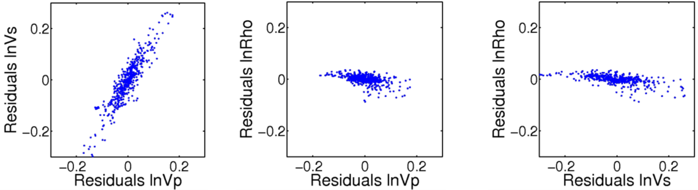
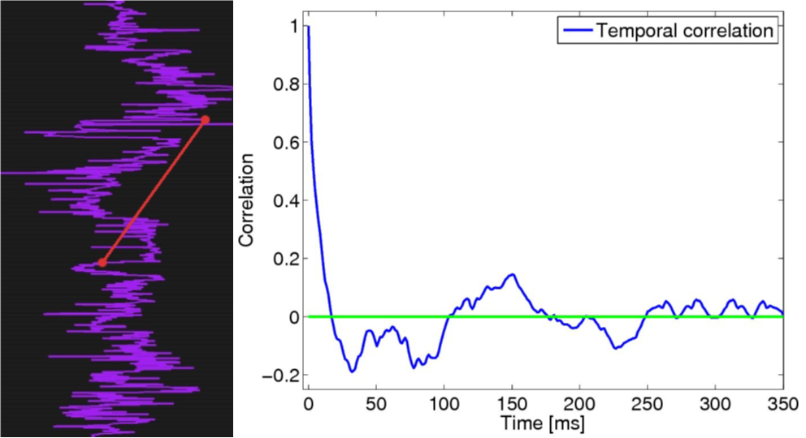
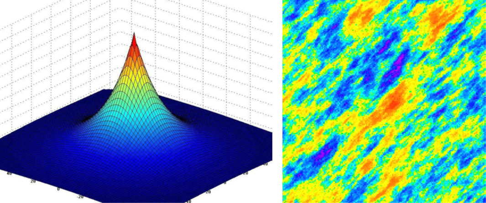

# Implementation

Whereas the general model was explained in Theory, details of the actual implementation will be described in more detail. here. The estimation routines implemented in CRAVA are based on straightforward and commonly used techniques. This gives fast and robust estimation, although we may run into problems if the number of data points is too small, or the data quality is too low. The quality of an estimation result is never better than the quality of the data it is based on.

## Estimating optimal well location

The positioning uncertainty between well data and seismic data is often significant. To overcome this, the well may be moved to the location with maximum correlation between the seismic data and the reflection coefficients calculated from the well data. The relation between the seismic data and reflection coefficients is linear; so linear covariance is a good measure. The optimal well location is found by searching for the location with highest covariance in a lateral neighbourhood around the original well location, where the well is allowed to be shifted vertically in each target position. The moving of wells is triggered by a command in the model file, and it is done prior to the estimation of wavelets, noise, correlations and background model.

## Estimating the prior model

The prior model for the Bayesian inversion is defined in [Theory](theory.md#statistical-model), and consists of the expectations of the elastic parameters $$V_p$$, $$V_s,$$ and $$\rho$$ collected in the vector $$\mu_m$$, and their spatial correlation structure collected in the covariance matrix $$\sum_m$$. These expectations and covariances must be given prior values before the inversion.

### Background model

The expectation $$\mu_m$$ is usually referred to as the background model. As the seismic data do not contain information about low frequencies, a background model is built to set the appropriate levels for the elastic parameters in the inversion volume. To identify this level, we can plot the frequency content of the seismic traces in the available wells, and identify lowest frequency for which seismic data contains enough energy to carry information. In the figure below, we have plotted the frequency content in the seismic data in two different wells. The green curve gives the frequency content in the near stack and the blue curve gives the frequency content in the far stack. These plots show that the seismic data contain little energy below 5–6Hz, and the purpose of the background model is to fill this void. The estimation of the background model is made in two steps. First, we estimate a depth trend for the entire volume, and then we interpolate well logs into this volume using kriging. The estimation will by default contain information up to 6Hz, but this high-cut limit can be adjusted using the relvant parameter.

When identifying the depth trend, it is important that the wells are appropriately aligned. The alignment is defined by the time interval surfaces specified as input, or alternatively, the correlation direction surface. It is important that the alignment reflects the correlation structure \(deposition/compaction\), and if the time surfaces are either eroding or on-lapped, one should consider specifying the correlation direction separately using the **correlation structure** parameter.

In the figure below, we show two well logs aligned according to deposition and according to the true time scale. Evidently, an incorrect trend will be identified if the true vertical depth is used. The size of the error will depend on the stratigraphy.

Assuming properly aligned wells, the trend extraction starts by calculating an average log value for each layer. This average is calculated for the $$V_p$$, $$V_s$$, and $$\rho$$ well logs and is based on all available wells. The estimation uses a piecewise linear regression, rather than the more straightforward arithmetic mean or moving average, as these measures are sensitive to the amount of data available. The piecewise regression has the additional advantage that it can give trend estimates also outside the interval for which we have data available.

For the linear regression we require a minimum of 10 data points behind each estimate. In addition, we require that the minimum number of data points must also be at least $$5*N_{wells}$$ . This way we ensure that data points from different time samples are always included. Alternatively, the regression would reduce to an arithmetic mean whenever there are 10 or more wells available. If we enter a region with no data points available at all, the minimum requirements are doubled.

To get the right frequency content in the depth trends, the regression values are eventually frequency filtered to 6Hz.

The trend extraction process is illustrated in the figure above for the $$V_p$$ and $$\rho$$ logs of a field with six wells. Note that the plots are oriented with layers as abscissa and log values as ordinate. The blue circles represent log values from any wells, the green curve is the piecewise linear regression of these values, and the red curve is the frequency filtered log that will be used as a depth trend. Note that the green curve is slightly erratic, especially, as we enter the region \(below reservoir\) where there are no data points available. This shift, which is clearly observed for the density, arises as we stabilise the estimate by requiring twice as many data points behind each estimate.

When the inversion volume has been filled with the depth trend, we interpolate it with 6Hz filtered well logs, to ensure that the background model will match in wells. A cross section of the resulting background model for $$V_p$$ is illustrated in the right part of the figure above. To the left is the corresponding depth trend. For comparison the well logs of $$V_p$$ has plotted in both illustrations. Note how the wells influence the volume in a region around the well.

Ideally, the background model should be as smooth as possible, and a Gaussian variogram model with relatively long ranges may seem an obvious choice. This model is too smooth, however, and should be omitted as it often give parameter over- and undershooting away from wells.

#### Multi-zone background model

In the multi-zone model, the reservoir is divided into several horizontal zones defined by surfaces in the inversion volume. In each zone, a local backround model is made by estimating a depth trend for the zone volume, then kriging well logs to the depth trend. The full multizone background model is made from the zone background models by using Beta distributions with $$\alpha = \beta = 2$$ for the transitions between the zones. The limits of the Beta distribution may be different for each surface, and they are given as input to the model. The background model in each zone contains frequencies up to 6Hz, but the frequency content is higher in the transitions between the zones. These higher frequencies will, however, contain information about the locations of the zones; hence they contain important prior information. Higher uncertainty gives smoother background models with lower frequency.

### Covariance

Since we model the covariance structure as separable, we have collapsed the full time dependent covariances between parameters into one parameter covariance matrix $$\sum_{0,m}$$, a lateral correlation vector $$\nu_m(\xi)$$, and a temporal correlation vector $$\nu_t(\tau)$$.

We estimate the correlations by first blocking the wells into the grid, and then do standard correlation estimation using

$$
\text{Cov}(X,Y) = \frac{\sum(x_i - \bar{x})(y_j - \bar{y})}{\sqrt{n - 1}},
  \text{with}\ X,Y\in\{\ln V_p, \ln V_s, \ln\rho\}
$$

The parameter covariance matrix is simply estimated by using the covariances at time lag 0. When rock physics models are used, the parameter covariance matrix is calculated from the expectation vector and parameter covariance matrix for each rock model weighted with the corresponding prior facies probability using standard statistical models. If trends are included in the rock physics models, the parameter covariance matrix is calculated in each reservoir position. The resulting parameter covariance matrix is then calculated as the average over these coveraince matrices.

In the figure below, we show cross plots of the parameter residuals \($$x_i - \bar{x}$$\) for a sample field. The depicted distributions look similar to bivariate normal distributions, which supports the normal distribution assumptions made in [Theory](theory.md#statistical-model). If there are no $$V_s$$ logs available, the prior Vs variance will be set equal to twice the $$V_p$$ variance, and their covariance will be set equal to zero. The temporal correlation is estimated from the remaining lags in the well logs as depicted in the figure below. The temporal correlation will be a weighted average of the estimates made for all three elastic parameters.

While the covariance matrix and the temporal correlation can be readily estimated from well data, this is not the case for the lateral correlation, unless there are a large number of wells available. The lateral correlation is therefore normally chosen parametric. There is an option in CRAVA to estimate the lateral correlation from seismic data, but these estimates are not made relative to stratigraphy and tend to grossly underestimate the correlation. Using a parametric correlation function is therefore encouraged. In the figure below, we have depicted an exponential correlation function and the lateral correlation structure this kind of function gives rise to.

### Likelihood model

As with the prior model for the elastic parameters, we have also collapsed the full time dependent error covariance matrix into a noise covariance matrix $$\sum_{0,e}$$, a lateral correlation vector $$\nu_e(\xi)$$, and a temporal correlation vector $$\nu_e(\tau)$$.

The lateral correlation is difficult to estimate and is chosen equal to that for the elastic parameters, that is, we use $$\nu_e(\xi) = \nu_m(\xi)$$. The temporal correlation is partly estimated from wavelet derivatives and partly white noise. By default, a 10% white noise fraction is assumed.

For the noise covariance matrix, the noise for a single angle gather can be either specified in the model file using the **S/N Ratio** parameter or it can be estimated. A noise estimate is found by generating synthetic seismic data \(see next section\) using the wavelet optimally shifted in each well, and subtracting this from the seismic data. The remaining part is assumed to be noise, and we measure the noise energy from this.

The correlation between the noise in different angle stacks is hard to estimate and is therefore chosen parametric. Typically, an exponential correlation functions with a range of $$10^\circ$$ is used. In most cases this implies that the noise in the angle stacks are treated as independent of each other.

## Estimating wavelets

The implemented wavelet estimation uses the approach of spectral division, see White \(1984\). In this approach an estimate of the cross-correlation between data and reflection coefficients, and an estimate of the auto-correlation of reflection coefficients are used to estimate the wavelet. The methodology requires that the reflection coefficients are known, thus wavelets are estimated at well locations. The cross-correlation between data and reflection coefficients is found by convolving the data with the reflection coefficients, and tapering the result. The auto-correlation of the reflection coefficients are found similarly by convolving the reflection coefficients with themselves and then applying a taper to the result. The tapering is performed in order to avoid spurious correlations at large lags.

Using the standard convolutional relation for seismic data,

$$
\mathbf{d} = \mathbf{w}*\mathbf{c}+\mathbf{e}
$$

where $$\mathbf{d}$$ is the seismic amplitude data, $$\mathbf{w}$$ is the wavelet, $$\mathbf{c}$$ the reflection coefficients, and $$\mathbf{e}$$ is the noise. We see that convolving the data with reflection-coefficients, transforming to the Fourier domain, and take the expectation we get

$$
d(\omega)\bar{c}(\omega) = w(\omega)|c(\omega)|^2
$$

Note that the convolution has disappeared, and the equation can be solved for each frequency $$\omega$$. We recognise the left hand side as the spectre of the cross-correlation between data and reflection coefficients. And the left hand side as the wavelet multiplied with spectre of the auto-correlation of the reflection coefficients. This can be obtained by dividing the spectre of the cross-correlation with the spectre of the auto-correlation.

Tapering of the estimated cross-correlation and auto-correlation is required in order to stabilise the estimate. In Crava a Papoulis taper is used. Tapering is equivalent to a local smoothing in the frequency domain, thus the resulting wavelet estimate will behave smoothly in Fourier domain. We find the optimal vertical shift for each well. The global wavelet is then found by taking the arithmetic average of the zero-phase wavelets, weighted by the number of samples used from each well.

When using local wavelets, we find the optimal shift and/or scale of the global wavelet at each well location. Optimal here means minimising the noise energy.We then use kriging to interpolate this between wells, with a shift of 0 and a scale of 1 as the mean level outside the well control area. This is illustrated in the figure below. Local noise is estimated using the local noise energies from above.We always use local shift when estimating the noise, but only use local scale if it is used in the inversion. If local scale is used, the noise is divided by this. A noise scaling factor is then computed in each well, and kriged as above.

## Estimating 3D Wavelets

The expression for the wavenumber representation of the point-spread function given in [Theory](theory.md#convolution-with-3d-wavelet) has only one unknown element, namely the 1D pulse $$w_0(\omega)$$. The functions $$\tilde{\alpha}_1$$ and $$\tilde{H}$$ are given as input, together with the average velocity $$V_0$$. The elements needed for the conversion from depth to time are also input to CRAVA. That is the reference depth $$Z_0$$, and reference time surface $$T_0$$. The theory for the estimation of the 1D pulse is given in Georgsen et al. \(2010a\), and with more details in Georgsen et al. \(2010b\).

## Using FFT for inversion

As previously stated in [Theory](theory.md#statistical-model), the equation separates when transformed into the Fourier domain. After this transformation, the equation becomes

$$
\mathbf{\tilde{d}}(\omega,\mathbf{k}) = \mathbf{G}(\omega)\mathbf{\tilde{m}}(\omega,\mathbf{k}) + \mathbf{\tilde{e}}(\omega,\mathbf{k}))
$$

The tilde denotes the 3D Fourier transform, with temporal frequency $$\omega$$, and lateral frequency vector $$\mathbf{k} = (kx,k_y)$$_._ Due to the separation, we now have a set of $$n$$ small equations, where $$n$$ is the number of grid cells in the inversion volume. Everything is still normally distributed, so the solution to this equation follows the pattern from the equations in [Theory](theory.md#statistical-model). We still must invert a data covariance matrix, but whereas this matrix had dimension $$(n\cdot n\theta)^2$$ before the Fourier-transform, the matrix we must invert here is reduced to dimension $$n\theta^2$$_, where_ $$n\theta$$ is the number of angle stacks. Since the time for a matrix inversion is almost cubic in size, it is much faster to invert $$n$$ of these small matrices than the one large. After solving for $$\mathbf{\tilde{m}}(\omega,\mathbf{k})$$, we do the inverse transform of this to obtain the distribution for $$\mathbf{m}$$. The same does of course hold when we are using local wavelets that are divided out in advance. For full details, see Buland et al. \(2003\).

## A note on local wavelet and noise

As shown, even though the use of FFT-transform requires stationarity, we are able to work around this. Wavelets can be made local since these can be divided out before solving the equations, and locally higher noise levels can be approximated by interpolating the low-noise solution and the prior distribution.

### Local wavelet - dividing out the wavelet

A simple division of data by wavelet can easily be done in the Fourier domain, where the convolution reduces to a multiplication, and the division can be done one frequency at a time. However, this is very unstable for frequencies where the wavelet is very weak or not present, and some sort of stabilisation is needed.

In CRAVA this is done in two ways. First, we set an upper and lower cutoff frequency for the wavelet, default set to 5 and 55 Hz. Furthermore, for frequencies that fall below 10% of the average amplitude, we set the amplitude to 10% of average before doing the division.

### Local noise

Local noise is implemented by first finding the solution using the minimum noise level, to fulfill the stationarity requirements of the FFT algorithm. We then interpolate the values for each locations between the prior and this minimum noise posterior. When doing this interpolation, we ignore correlation between locations. This is not a problem as long as the noise varies slowly and smoothly.

For each location $$\mathbf{x}$$ the adjusted estimate $$\tilde{\mu}_{m|d_{obs}}(\mathbf{x})$$, is found from the inversion result $$\mu_{m|d_{obs}}(\mathbf{x})$$ by a linear relation,

$$
\tilde{\mu}_{m|d_{obs}}(\mathbf{x}) = \mu_{m}(\mathbf{x}) +\mathbf{H_x}\left(\mu_{m|d_{obs}}(\mathbf{x})-\mu_{m}(\mathbf{x})\right)
$$

The matrix $$\mathbf{Hx}$$ **is a shrinkage matrix, i.e. the adjusted estimate is always closer to the prior mean than the inversion result. The matrix** $$\mathbf{H_x}$$ _\_depends on the local error variance $$\sum_{e}^x$$and error variance used in the inversion$$\sum\_{e}^0$$

To find the shrinkage matrix we first identify a matrix $$\mathbf{G}0$$ _\_which maps the local prior distribution to the local posterior distribution when it is observed with the noise $$\sum_{e}^0$$, that is,

$$\mathbf{d}(\mathbf{x}) = \mathbf{G}_0\mathbf{m}(\mathbf{x})+\mathbf{e}_0,$$

where $$\mathbf{e}0\sim N\left( \mathbf{0},\sum_{e}^0\right)$$. The inversion of this expression is a linear relation

$$
\mu_{m|d_{obs}} =\mu_{m} +\mathbf{P}(\sum_{e}^0)\left(\mathbf{d}_{obs}-\mu_{d}\right)
$$

where $$\mathbf{P}(\sum_{e}^0)=\sum_{m}\mathbf{G}0^T \left( \mathbf{G}_0\sum_{m}\mathbf{G0}^T+\sum_{e}^0\right)^{-1}$$.

We then define the shrinkage matrix to be:

$$
\mathbf{H_x}(\sum_{e}^\mathbf{x},\sum_{e}^0) = \mathbf{P}(\sum_{e}^\mathbf{x})\mathbf{P}(\sum_{e}^0)^{-1}.
$$

This removes the effect of the standard inversion and add the effect of the locally adapted inversion. The matrix $$\mathbf{P}(\sum_{e}^0)$$ is not invertible, but since the local noise always is larger than the noise in the inversion the product in expression above is always well defined.

## Local memory management

Both the model building and the inversion are consuming a significant amount of local memory. An estimation of the amount needed is displayed on the user interface of each. If the amount is too big compared to available local memory then you need to restart Pre-Stack Pro and to decrease the amount of global memory allocated or grab more nodes.

