# Cross Plot

Cross Plot is launched from the **Interpretation-Processing** menu. The module allows the user to generate two types of plots: density plots for data with large numbers of data points \(e.g. seismic volumes\) and scatter plots \(e.g. for well logs\).

There are 4 types of plot:

* **Volumes**: density plot of two seismic volumes. Volumes must loaded into the Data Pool
* **Volume Axes**: density plot to interrogate a single seismic volume. Volume must loaded into the Data Pool
* **Well Logs:** scatter plot for well logs. Logs are loaded from the project and do not need to be in the Data Pool.
* **Facies**: scatter plot for PCube LFC classes. Facies are loaded from the project and do not need to be in the Data Pool.

Click on **Add Plot** to start, selecting the type of data to plot. The new plot will be listed in the Data Tree and can be toggled off/on, removed, renamed or the colour changed. Clicking on **Add Plot will duplicate the previous plot**, reducing the time to setup the display. The volumes can then be changed as required. Clicking the arrow next to Add Plot allows the user to add a new plot without duplication.

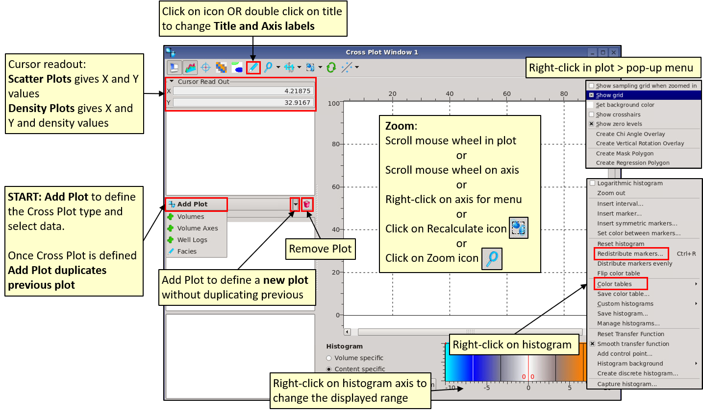

The Cross Plot display can be modified by changing the title, axis labels, axis ranges, histogram colour table and range, background colour and grid. The plot can be set with 1:1 display ratio, required for calculating chi angle lines. 

For scatter plots regression lines can be fitted to all the data displayed, or the data within a polygon.

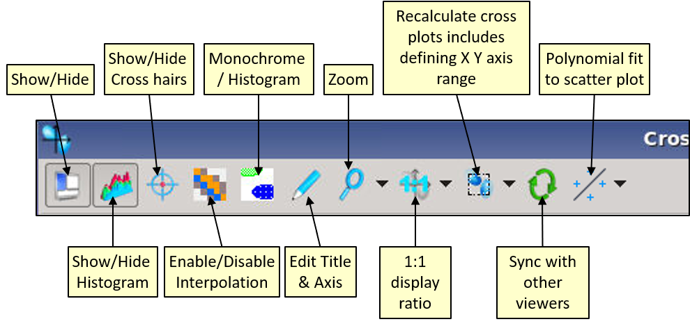

Once the cross plot is setup, the axes ranges can be changed either by clicking on the axis and giving a min/max OR by opening up Recalculate all crossplots icon and changing the axes ranges. Options include to use an average +/- 3 std. dev of each volume, absolute min and max for each volume or to manually define the ranges. There is also the option to change the bin size.

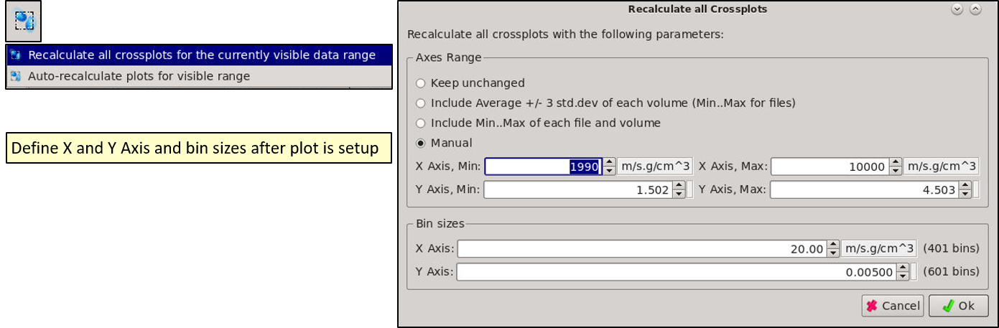

## Volume Plots

**Add Plot &gt; Volumes**

Seismic volumes or maps can be plotted, but they must be loaded into the Data Pool. Select the volumes as required, press OK. 

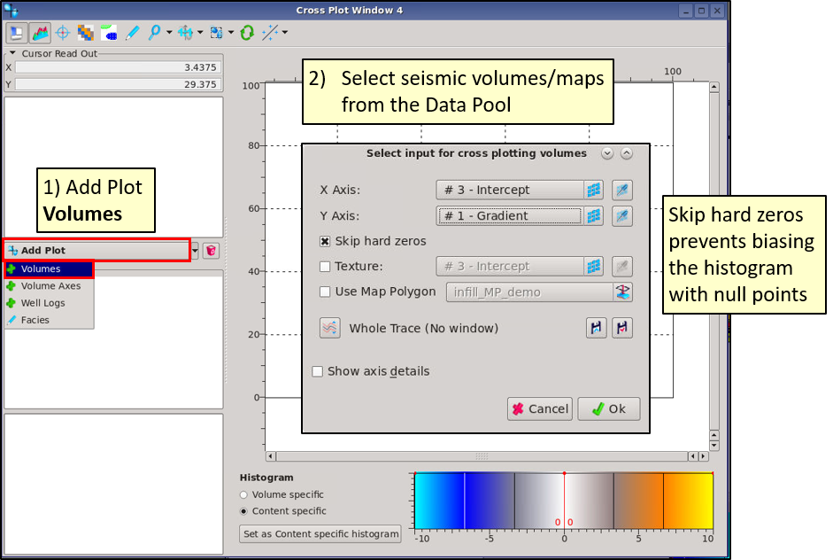

Details of plot setup

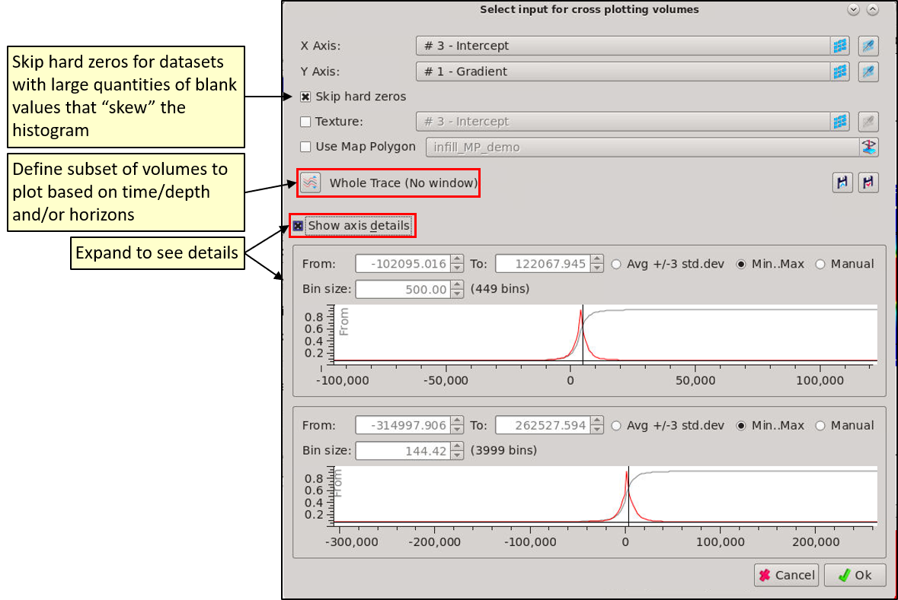

Volumes can full trace or limited in time/depth and/or by a horizon. This can be changed at any point within Cross Plot window.

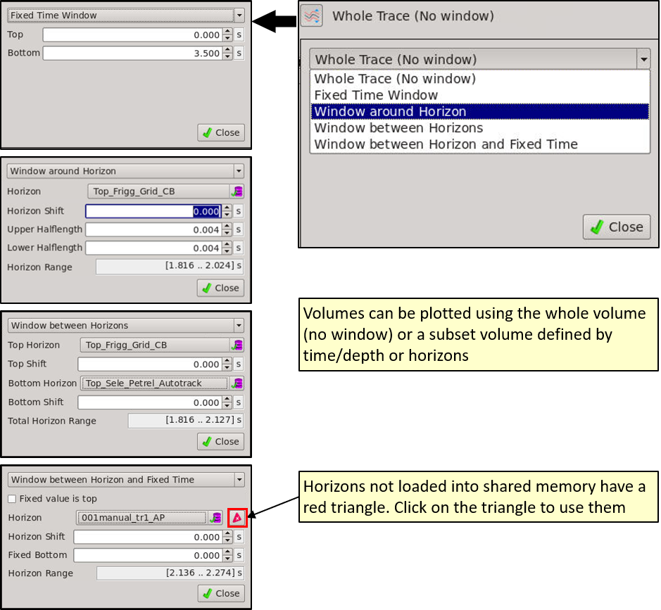

To setup the display the user can change the plot Title, Axis labels and change the histogram. The plot can be changed at any point by selecting a different volume, changing the volume subset, applying texture \(3rd attribute\) and/or using polygons. 

**Add Plot duplicates the previous plot** making it faster to add to the cross plot. To add a new volume without duplication click on the arrow and select **Add Volume Plot**

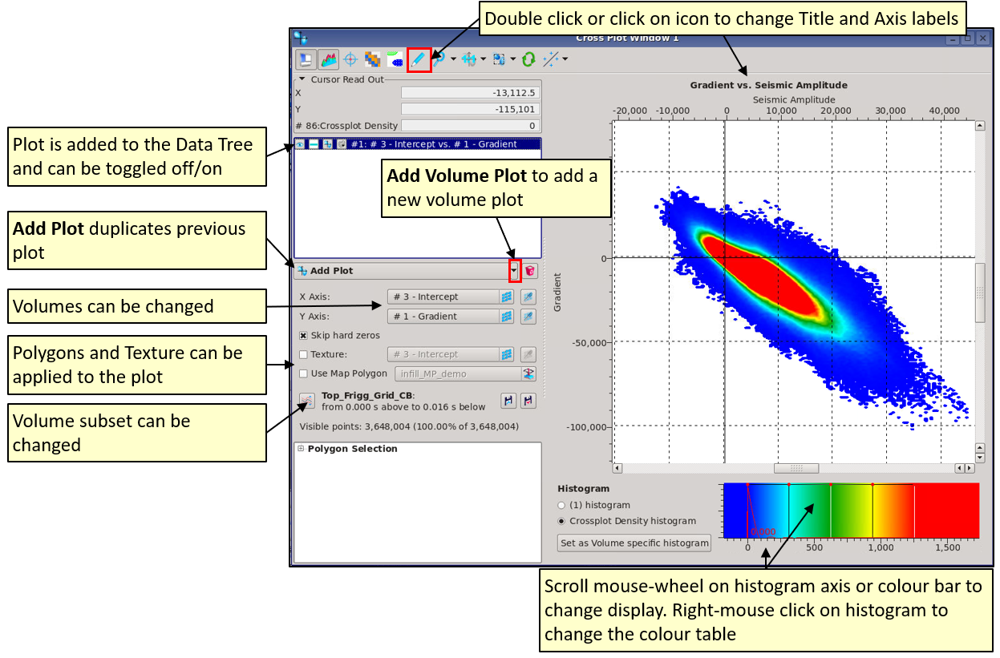

Volume plots can be displayed by their colour in the Data Tree instead of by histogram by toggling the **monochrome/histogram** icon.

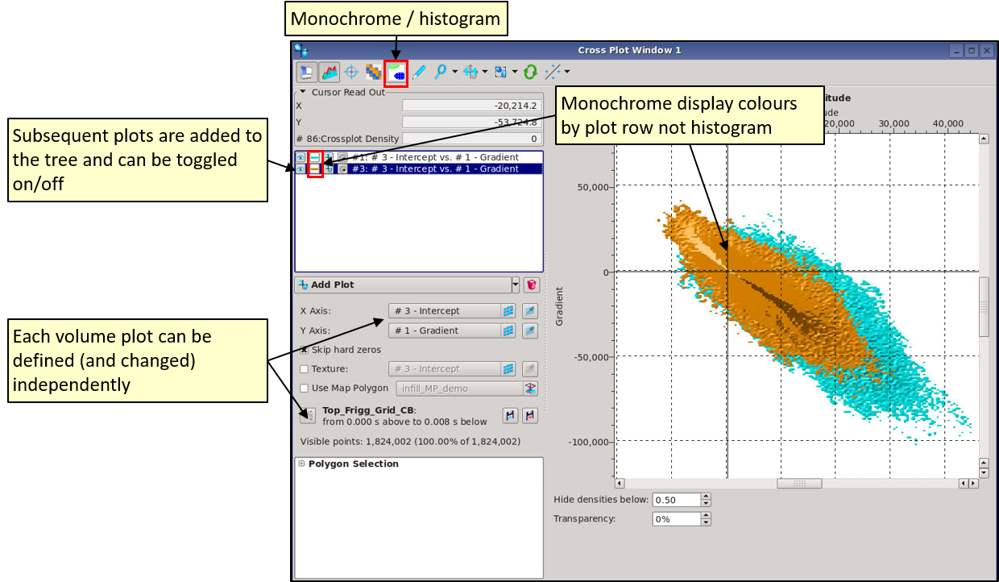

### Isolines

For density plots isolines  calculated from point density can be displayed, with first and last values, increment, colour and labels defined by the user.

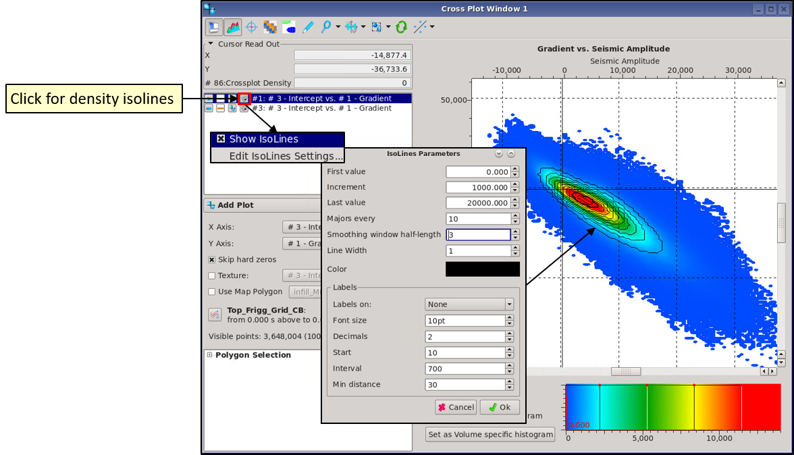

### Chi Angle Overlay

Chi angle overlays can be applied to the relevant seismic volume plots. The display will automatically reset to to 1:1 ratio. User controls the Angle. Press **calculate Chi angle volume** __to add the chi volume to the Data Pool.

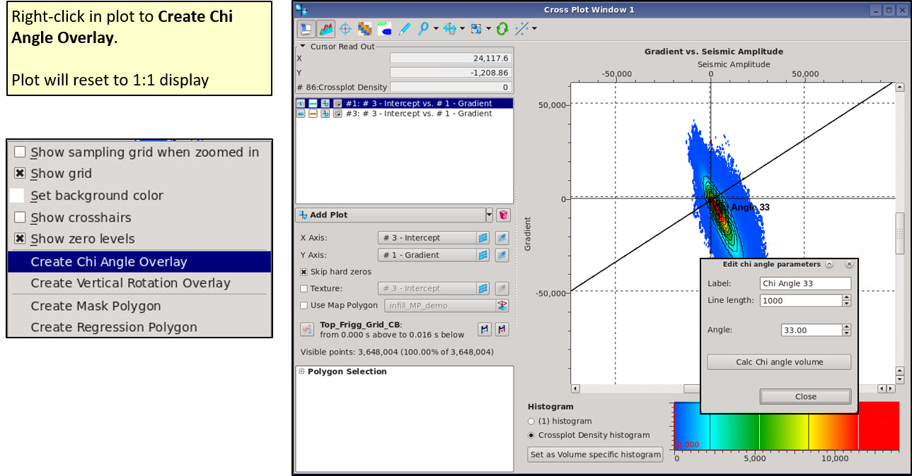

### Mask Polygons

Mask polygons are used to link the cross plot with vertical seismic displays or maps. Data points within the mask polygon are given a single value of 1.0  and 0.0 for outside, "masking" those points on the vertical section/map. 

Right-click in plot and select **Create Mask Polygon:** a polygon appears - shift it and move the points \(add points with CTRL\) as required. Select calculate mask volume. The mask polygon can be fixed or kept as a dynamic object that auto-updates sections/maps when moved. 

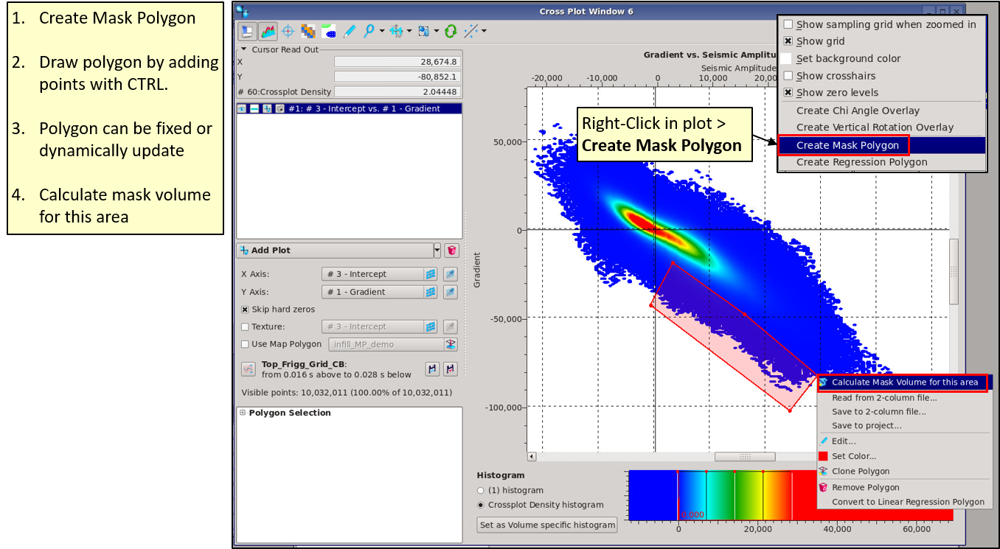

Open a gather/section/map window and drag the mask volume onto it to view the results. If dynamic update is being used, move the Mask around the plot and the transparent mask display on the gather/section/map will update.

QC, Volume Calculator can be used to multiply the original seismic by the mask volume. This remove amplitudes that aren’t inside the polygon \(multiplied by zero\) and leave just those inside. A kind of ‘cookie cut’ of the original volume by the mask volume results

## Volume Axes Plots

**Add Plot &gt; Volume Axes** 

Volume axes allows for investigation of a single seismic volume, with the options to plot inline, crossline, sampling \(e.g. Z axis\), fold and content \(e.g. amplitude\).

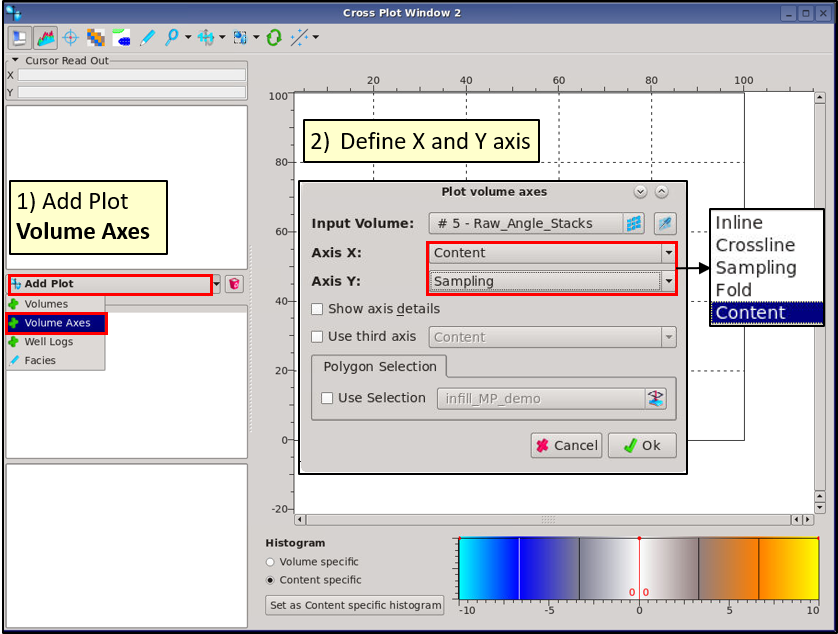

The example below plots amplitude against time. Isolines can be added to the plot.

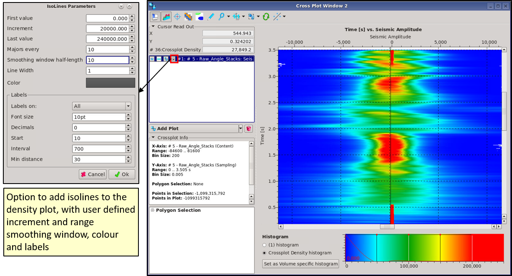

## Well Log Plots

**Add Plot &gt; Well Log**

Well logs are plotted as a Scatter Plot, defined by the first logs chosen to setup the plot. For example, if the user selects Vp and Vs logs the Cross Plot is set Vp and Vs as the axes. Subsequent logs added to the plot will be limited to Vp and Vs logs. The axis ranges are automatically set according to the log datatypes \(go to the File Manager to define or change log data types\).

The well, logs \(in the case of a Vp / Vs plot only those logs are available\), zone and 3rd attribute can all be changed at any point after setup. 

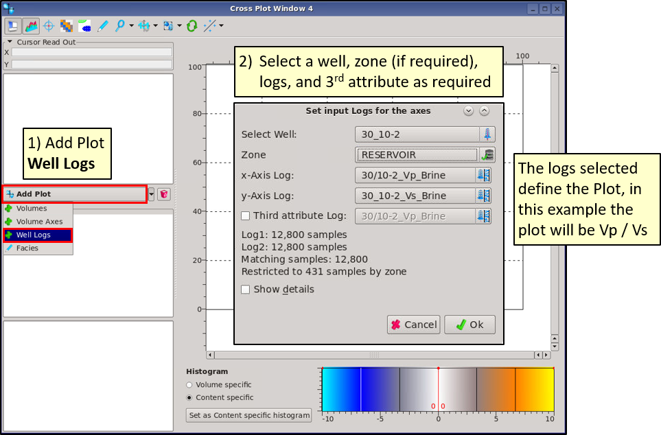

Multiple wells can be added to the plot, or the same well plotted multiple times for different zones/fluid fills. **Add Plot duplicates the previous well plot** \(copying well, logs and zone\), making it fast and efficient to extend the plot. The user then changes the well/logs/zone etc. as required to update the display.

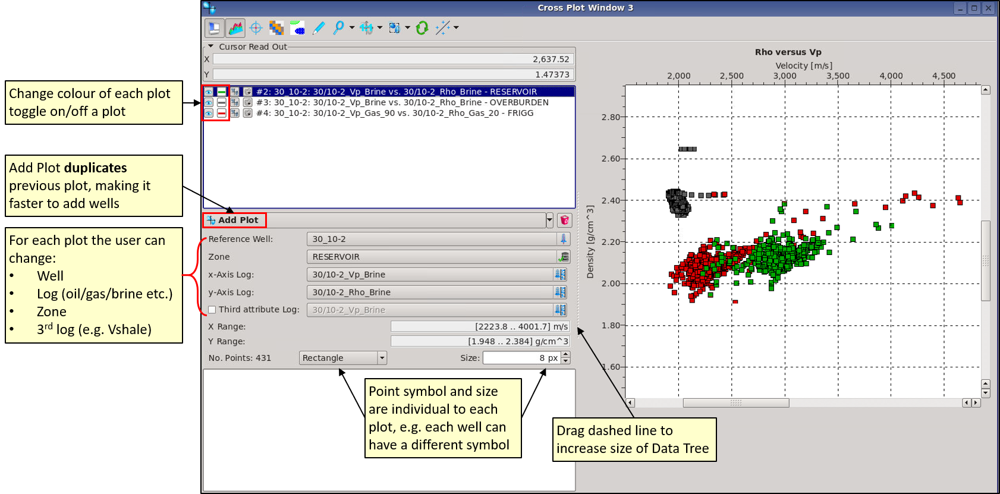

Well log plots can be coloured by a 3rd attribute log with a histogram colour scale applied. 

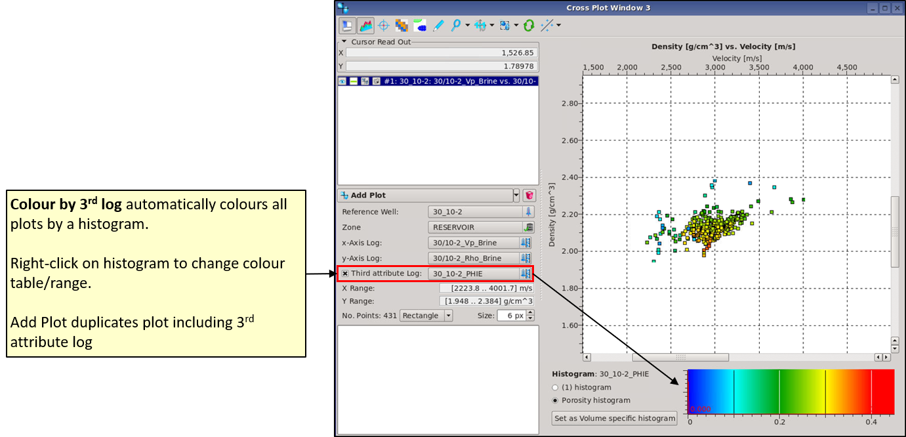

### Regression Lines

Polynomial fit lines are only available for scatter plots. Then icon from the menu applies a polynomial fit to **all the well log data displayed in the plot**. If a well is toggled off it is not included. The function f\(x\) can be copied to the clipboard.

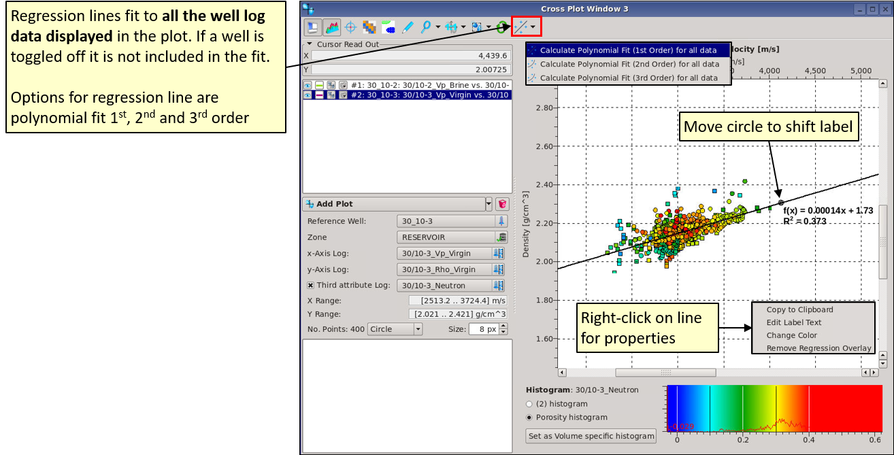

Polynomial fit lines can be applied to well log data **within a polygon:**

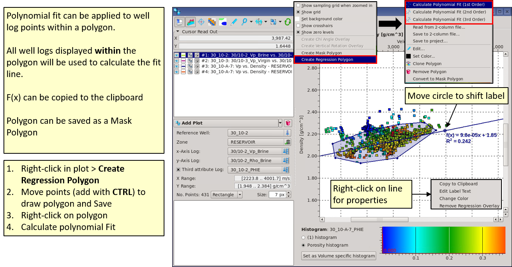

## Facies Plot

**Add Plot &gt; Facies**

PCube LFC classes can be cross-plotted, on their own or with PCube output volumes. The user has a choice of running simulations to produce point clouds for each selected LFC, or replacing these simulations with real well  log Vp/Vs/Rho values \(if available\). LFC classes may also be cross-plotted with seismic amplitude datasets, if AVA attributes such as reflection coefficients or Intercept and Gradient are chosen. There are 15 properties/attributes to choose from.

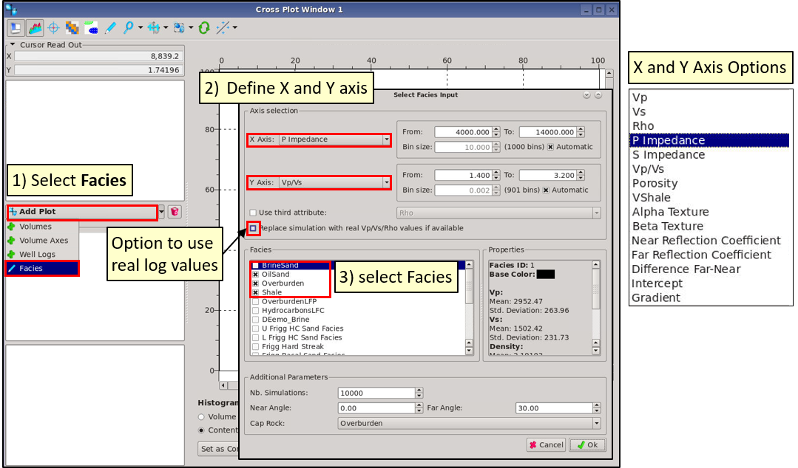

The facies are listed in the Data Tree and can be toggled off/on or removed. To change the colour of a facies click on the colour-icon in the Data Tree.

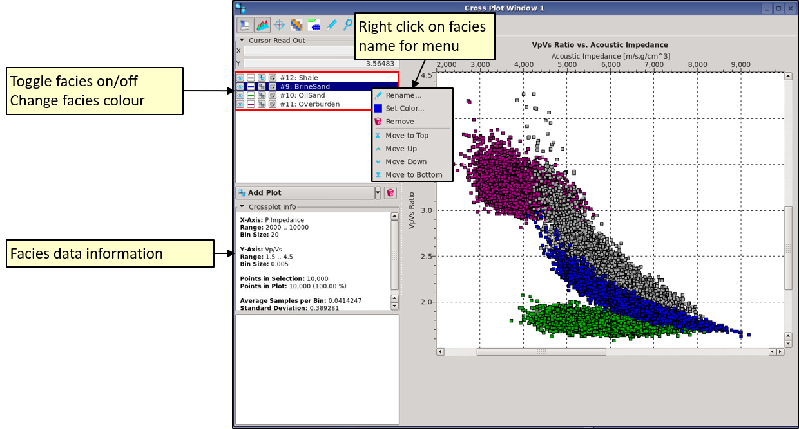

