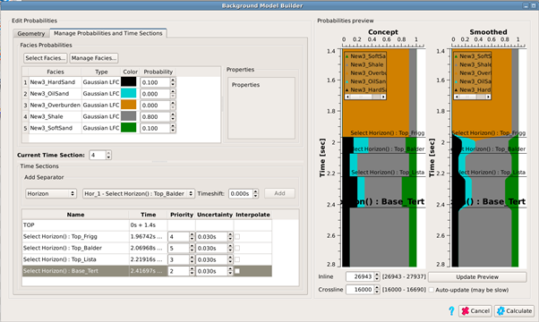
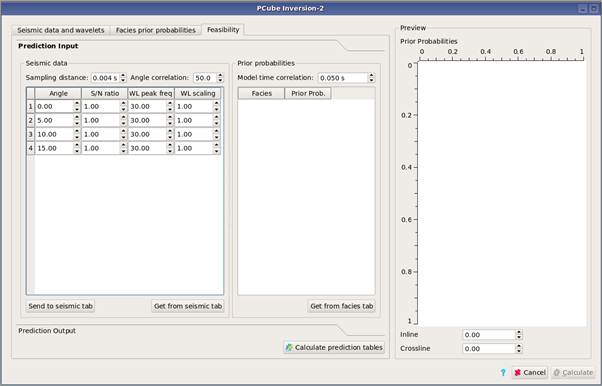
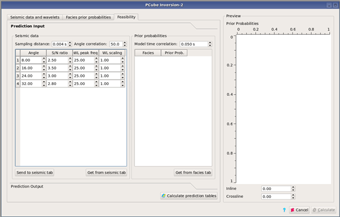
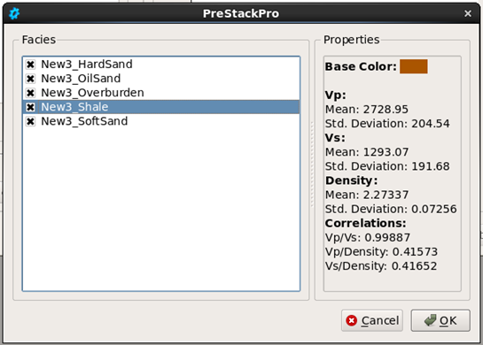
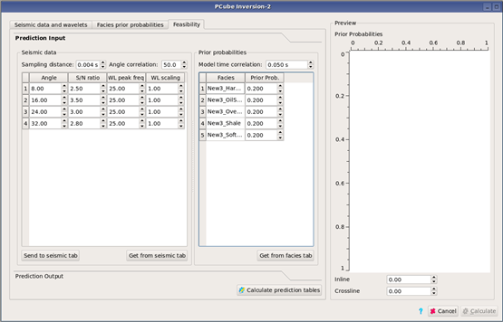
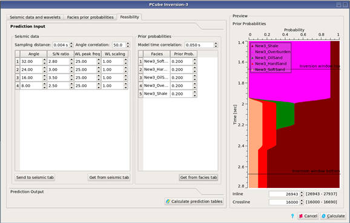
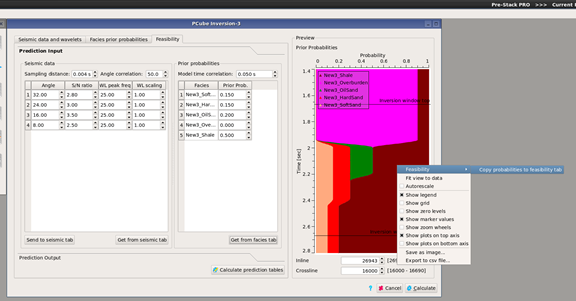
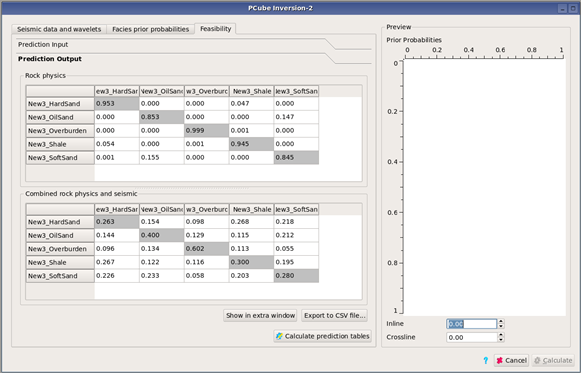

# Feasibility Modelling

The feasibility modelling tab in PCube is used to analyze the facies classes and seismic data quality and it produces information about ambiguities and uncertainties in the inversion results. It can be used before running an inversion to find out whether it will supply the required information, and also after the inversion to help understand the results. There are two main types of input, one being the parameters associated with seismic quality such as signal-to-noise levels and frequency content for each angle stack, while the other is the information about the litho-facies classes. The output consists of two tables. Both contain probabilities for each litho-facies, given that one litho-facies is correct, for the classification to come out as any of the litho-facies. One table shows results based purely on the rock physics information, while the second also incorporates the seismic information.

The litho-facies must be defined. The seismic data are not required.

To run the feasibility modelling, click on the Feasibility tab in PCube. The Seismic data table and the Prior probabilities table must be filled.

To do this, right click in the white area of the Seismic data table, and select “Add row”. One row must be added for each angle stack to be used in the inversion.

The table can then be filled in with the necessary information, just as it is when loading the data in the “Seismic data and wavelets” tab.

As an alternative, if the information has already been supplied in the “Seismic data and wavelets” tab, click on the “Get from seismic tab” button to copy it into this table.

The “Sampling distance” should be set to the seismic sample interval. The “Angle correlation” is described in the [PCube](pcube+/) description.

To fill in the Prior probabilities table, right click in the white space. This brings up a selection box listing all facies defined in the project. Select all of the desired facies and click Ok.

The prior probabilities table is then populated.

Prior probabilities are set for each facies. The “Model time correlation” is described in the [Pcube](pcube+/) section.

If the litho-facies have already been loaded in the “Facies prior probabilities” tab, instead of creating the table manually it can simply be copied from the other tab using the “Get from facies tab” button. In this case, the prior model is displayed in the right hand panel.

If this option is used, the prior probabilities can be set for a particular layer by right clicking in the display at the correct depth. The context menu has an option to transfer the prior probabilities into the table.

This makes it easy to investigate individual layers.

Once all of the parameters are set, press the “Calculate prediction tables” button. The modelling runs simulations to estimate the posterior conditional probabilities shown in the tables. The result is two tables.

Each row in the tables is labelled by its litho-class. The probability that this litho-class is classified as any of the classes is given across the row. For example, in the first table above, the first row shows that if the litho-class is really New3\_HardSand then the probability of correct classification is 0.953 \(first column\) and there is a 0.047 probability of incorrect classification as class New3\_Shale. The first table only uses the rock physics information, and thus quantifies the overlaps between classes which can be seen by crossplotting the litho-facies. The second table incorporates the seismic information. In the first row of the example, it can be seen that the probability of correct classification of New3\_HardSand has decreased considerably to 0.263, while the probability of mis-classification as NEW3\_Shale has gone up to 0.268. Unfortunately, the noise and resolution limitations of seismic data always result in poorer results than those obtained from the rock physics alone. In fact, looking at this table shows a high degree of misclassification with many of the table entries in the range 0.1 to 0.3. This suggests that the litho-classes need to be redefined to have more discrimination, given the seismic limitations.

Once the prediction tables have been created, they can be displayed separately using the “Show in extra window” button. This allows easy comparison of different runs. To rerun, click on the “Prediction input” tab and edit parameters as desired, then “Calculate prediction tables” again.

