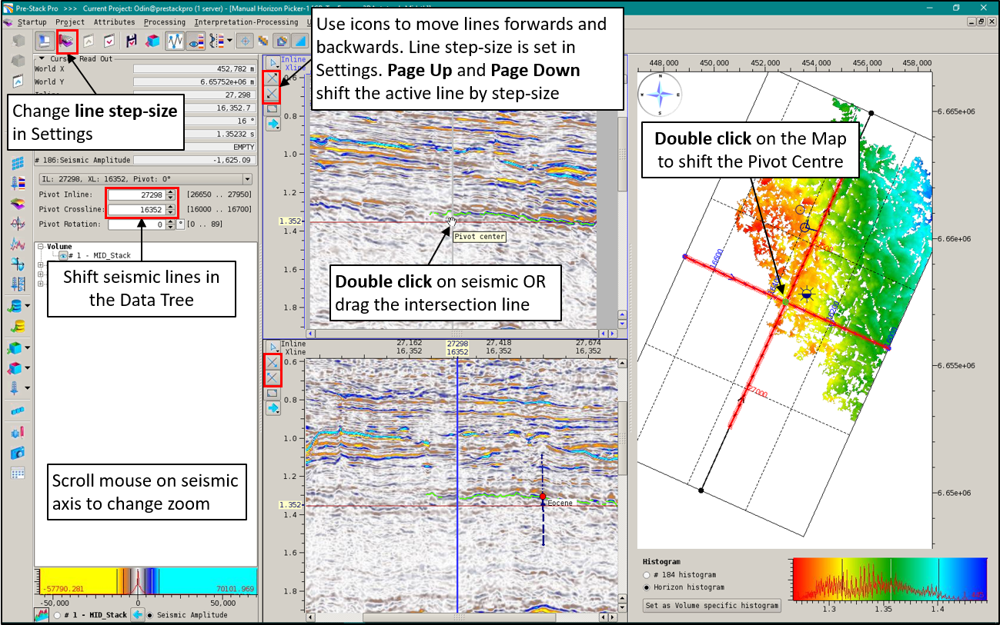
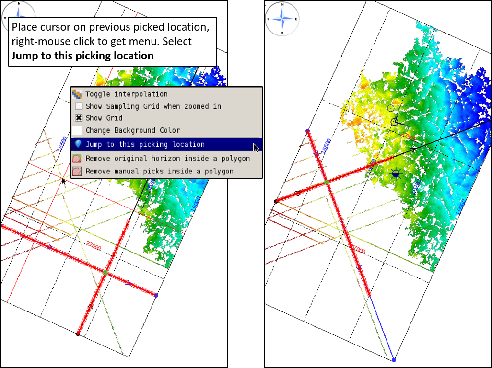
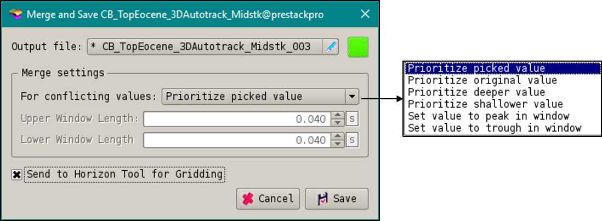

# Manual Horizon Picking

To complement the existing 3D Autotracker, we introduce a new module to the Pre-Stack Pro suite of interpretation tools: Manual Horizon Picking. This is a new canvas for seismic interpretation that incorporates orthogonal seismic section displays with a map window, allowing the user to manually pick new horizons or fill in holes in existing horizons.

Manual Horizon Picking is launched from the **Interpretation Menu**. Once launched, the canvas is blank. Click on the **Initialisation and Settings** icon to start:

## Initialisation and Display Setup

1. Select the seismic volume, this can be time or depth, stack, pseudo stack, or pre-stack gathers
2. Select an existing horizon to update OR create a new horizon
3. Choose the snapping type for the horizon: no snap, peak, trough or a zero-crossing \(+ to –, or – to +\)
4. Press OK.

You may return to these settings at any time during interpretation and change the snapping options or line step-size etc. If you wish to change the horizon or seismic volume you will need to exit and start Manual Horizon Picking again.

The main menu has a number of icons for interpretation:

There are three main panels in the canvas: the **Data Tree**, two **Seismic Sections**, and a **Map**. 

The **Data Tree** controls the display of wells, horizons, seed-sets on the Seismic Sections and the Map. The cursor readout is displayed at the top of the Data Tree, showing the amplitude etc. of the cursor on the seismic. It is also where the user can select the seismic lines to display, and access the history of their manual interpretation locations.

The **Seismic Sections** show two, orthogonal seismic lines and the intersection lines between them. On start up and inline and cross-line are displayed. These can be rotated to form Pivot Lines \(see below\). The scale of the seismic can be changed by scrolling the mouse-wheel on a an axis. Note the Z axis zoom is linked between the two sections. 

The icons in the Seismic Sections control the picking mode, moving the seismic lines in addition to expanding the Seismic Section to full screen, and lastly to reverse the display.

The **Map** window displays the current horizon selected for interpretation. The colour bar can be changed and the range altered as required, \(mouse click on the colour bar\). The intersection of the two Seismic Sections is called the Pivot Centre. The visible extent of each Seismic Section is highlighted in red on the Map. The location of the cursor is linked between the two Seismic Sections and the Map, with a cursor readout shown in the Data Tree

## Pre-Stack Seismic

For pre-stack seismic there is an additional panel: the **Gather Panel**. Pre-stack seismic \(pseudo or gather\) are stacked on the fly, with the user controlling the stack angle in the Data Tree. The number of gathers shown is set in Settings. As the user picks a horizon it is projected across the gathers. To create a pre-stack horizon \(that is picked on all angles\) the user must open Horizon Tools and select "Extend horizon to pre-stack"

## Moving Seismic Lines

There are a number of ways to move the two seismic lines, the intersection of which is called the Pivot Centre.

* **Data Tree**: 
  * Type in the seismic line number, or use the up and down arrows. Note, the user can scroll the mouse-wheel with cursor inside the line number box.
* **Seismic Lines**: 
  * Use the icons to move forwards and backwards, they will shift by the step-size as defined in Settings
  * Page Up and Page Down move the active line \(currently being picked\) by the step-size
  * Double click on a seismic line to move the intersecting line to that location.
  * Hover cursor on intersection line, cursor turns to a hand and line can be dragged to a new position.
* **Map Window**: 
  * Double click to shift the Pivot Centre of the two seismic lines \(i.e. move the intersection point of the lines\)

**Pivot Lines:** Pivot lines are rotated inlines and crosslines that maintain an orthogonal relationship, allowing the user to interpret on strike and dip seismic sections. Pivot Lines are defined by an angle rotation from the inline direction. There are two ways to rotate Pivot Lines:

* **Data Tree**: Type in the angle of rotation, or use the up and down arrows, or scroll the mouse wheel \(with cursor inside box\)
* **Map Window**: Hover the cursor on the pivot centre and scroll the mouse-wheel

The seismic displays can be changed to **Wiggle displays**:

## Manual Horizon Picking

There are three methods of manually picking a horizon, and they are listed under the Picking Modes icon on each Seismic Section. They can also be accessed from hotkeys \(see Hotkeys\). The snap and autotrack settings \(eg peak or trough\) are defined in **Settings**, on the main menu.

**Picking Modes:**

* Flat Line - straight connectors between control picks that snap to seismic after apply
* Spline - curved connectors between control picks that snap to seismic after apply
* Autotracking - 2D autotracking along the seismic line

**Flat Line and Spline:** add picks by clicking with left-mouse button. To accept the picks **double click** OR right-mouse click and Apply. For both modes, holding **SHIFT will stop snapping**

**Autotracking**: Place a seed point on the seismic, and **double click** / right-mouse click and Apply.

To move a seismic line whilst picking press **ESC**, double click to move the intersecting line, then ESC again to return to picking mode.

**Control Picks** can be toggled ON/OFF using the icon in the main menu:

## Hotkeys

## Editing Manual Horizon Picks

There are various ways to edit the original input horizon and the manual picks. For extended horizons, the original horizon and the new manual-picks are treated as separate entities until they are saved as one combined horizon. Whilst picking, the manual picked horizon can be overwritten by new picks. 

After applying manual picks, they can be changed by selecting to **edit** or **remove**:

Alternatively there are editing options in the Seismic Section picking options and in the Map panel:

**Seismic Section**, from the picking options menu:

* Remove from picked line: Draw a horizontal range, highlighted in red, to remove a section of manual picks
* Delete picks on this line: Deletes all the manual horizon picks from that seismic line
* Remove from input horizon: Draw a horizontal range, highlighted in red, to remove a section of the input \(original\) horizon

**Map Panel:** polygon delete. Right-mouse click in the Map window to remove with a polygon.  Draw the polygon by holding **CTRL** and adding points with the mouse. The polygon can be dragged around the Map window.

* Remove the original \(input\) horizon
* Remover manual picks. 

## History

The history of all the manual pick locations is saved and can be accessed to return to the exact location for all pick, be it a pivot line or inline/xline. There are two ways of accessing the location history:

**Data Tree**: Use the pull-down menu to access the list of all the locations for manual picks made for this horizon. To jump to one select it from the list.

**Map Window**: On the horizon map, place the cursor on a previously picked location, right-mouse click to get the menu. Select Jump to this picking location.

In addition to the locations of the picks, **Sessions** can be used to store a state of the horizon picking. Restoring an older Session will restore the manual picks EXACTLY as they were at the point of Session Save. See Session Save.

## Well Synthetic Displays

To display a well synthetic, ensure Wells are toggled ON in the Data Tree, then go to the Overlays icon in the main menu. Select a well,  then choose the synthetic. The **synthetic must be in the Data Pool** for the Manual Horizon Picker to see it. The wiggle display can be changed as required. Multiple overlays can be added to the same well, or different wells.

Note the default Time/Depth Table for that well is used. This is defined in _**Utilities &gt; Manage Wells**_

## Well log display

To display a well log, ensure Wells are toggled ON in the Data Tree, then go to the **Overlays** icon in the main menu. Select a well, then choose the log to display from the Input WellLog tab \(the logs do not have to be in the Data Pool\). Width \(traces\) is the width of the log track, and the log fill is coloured by Fill Positive.

Note the default Time/Depth Table for that well is used. This is defined in _**Utilities &gt; Manage Wells**_

## Sessions

Sessions can be saved, and when reloaded will reproduce the display including seismic line locations, and the picked horizon EXACTLY AS IT WAS AT THE TIME OF SESSION SAVE. This is a method of saving the history of the manual picks, and restoring an older session will restore the state of the manual picks exactly as the were when the Session was saved.

Multiple Sessions can be saved when picking a horizon. Sessions are not the same as Saving the horizon to the project, and Sessions can be saved without Saving the horizon into the project.

## Saving

Click on the Save icon in the menu bar. Saving the horizon into the project makes it accessible by other modules in Pre-Stack Pro. The user has the option to rename the horizon, saving it as a new horizon into the project.

If the user extended an existing horizon, at the point of saving if there are conflicting points between the input horizon and manual picks the user can select the prioritisation between them.

Toggling ON **Send to Horizon Tools for gridding** will save, and automatically open Horizon Tools to grid the horizon.

## Exporting Seed Points

If the user decides the horizon being picked could be autotracked more efficiently in 3D, the manual picks can be converted into Seed Points for input into the 3D Autotracker in Horizon Tools.

Open **Horizon Tools** to run the 3D Autotracker:

