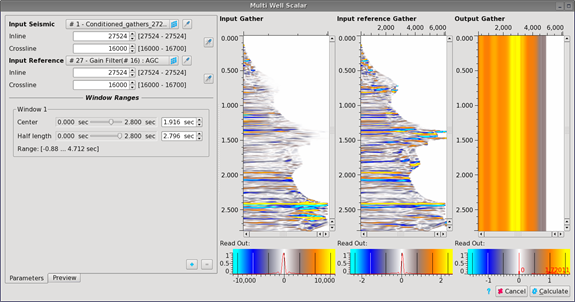

# Multi-Well Scalar

For each synthetic gather with well log information, a separate scalar gather can be calculated.

If there's only one synthetic gather, the resulting scalars should be saved with the project after generation and can then be used directly in the AVO Scaling.

For more than one synthetic gather, the resulting scalar gathers have to be exported as SEG-Y.

After all gathers have been created and exported, they can be brought back using the import SEG-Y algorithm taking all SEG-Y files at once, marking the content as SRMS \(please refer to the [SRMS](../../data_management/select_data/select_q_data-_srms_data_or_eta.md) part of the manual\) and then be used in [AVO Scaling](avo_scaling.md).

Go to: **Interpretation Processing** → **Multi Well Scalar**

_Multi well scalar dialog_

This window is composed of 3 parts:

**The left part of the window:**

In the **Data Selection**, the Multi-Well Scalar needs a seismic pre-stack gather together with a synthetic gather as input. Both can be taken from individual locations in a bigger volume using the inline/crossline selections.

Within the specified time windows specified in the **Window Range** part, scalar is calculated using the RMS values of both seismic and synthetic gather. There can be up to three of those time windows in a single gather to allow longer windows with increasing time. Pressing the “+” adds another time window. “-“ removes it.

**Right part of the window:**

The **Input seismic gather** displaying the gather corresponding to the inline- crossline pair noted in the **Data Selection** at the top-center of the dialog

The **Input reference gather** is showing the currently selected **synthetic** reference gather for the algorithm.

This shows the resulting scalar gather for the selected parameters. The scalars that are calculated in the center of the given time windows are interpolated/extrapolated over the whole gather.

