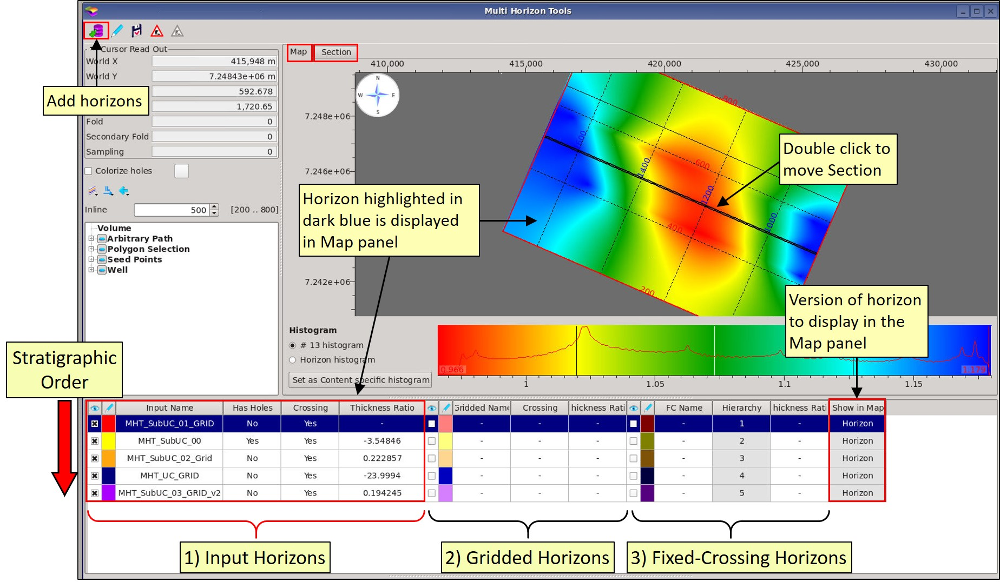

# Multiple Horizon Tool

Multiple Horizon Tools is designed to fill holes in horizons and fix crossing errors to generate complete grids for input to CRAVA and PCube+, in addition to general interpretation use.

The workflow is as follows:

1. **Load input horizons**
2. **Run Gridding**
3. **Check the stratigraphic order and hierarchy**
4. **Run Fixed Crossings**
5. **QC results**

Fixed Crossings can be an iterative process with the user changing stratigraphic order and hierarchy to achieve the desired results.

Multiple Horizon Tool is in the **Interpretation-Processing** menu and starts with an Add Horizons menu. Select the horizons as required, these can be changed later. Input horizons can be: manually picked horizons, autotracked horizons, a combination of 3Dautotracking and manual picks, or grids. The tool works with time or depth horizons, but not prestack surfaces.

Once loaded, horizons are listed in a table, with the highlighted horizon displayed in the Map window. To change the map display, click on a different horizon in the table. A Section panel displays all the horizons in a vertical section.

The input horizons are automatically analysed for holes and if they cross each other. The results are listed in the table. The thickness ratio \(min isochron thickness / max isochron thickness\) is automatically calculated and is listed in the table. Additional horizons can be added to the table. Horizons can also be removed from the table.

The **checking area** defines the lateral extent of the gridding process and can be manually set using inline and crossline ranges or set to match a volume in the project \(e.g. a seismic volume to be used in CRAVA\).

The **section view** displays the horizons in a vertical display as either an inline, crossline or arbitrary path. Horizons can be togged on/off in the table, they can also be removed and additional horizons loaded from the project. To change the colour of a horizon click on the colour icon in the table.

**Gridding** fills holes in the horizons and extends them to match the **checking area**. This is done in a batch mode with all horizons being gridded using the **ABOS** gridding method. The grids are added to the table \(with the suffix \_G\) and by default are displayed in the Section panel. Crossings are re-calculated, as are thickness ratios.

Once gridding as been performed, **Fixed Crossings** can be run. The hierarchy and stratigraphic order defines how the crossings are terminated. These can be changed and Fixed Crossings rerun multiple times to produce the correct result.

Click on the horizon name to shift its stratigraphic position in the table. Click in Hierarchy and select from the drop-down menu to change the number, with 1 being the top priority.

Stratigraphic order and Hierarchy achieve different results as follows:

Grids and Fixed-Crossing horizons should be **quality controlled** both in the Section panel and the Map panel. Select the display horizon version from the drop-down menu in the table:

Save grids and/or fixed-crossing horizons to the project. By default grids are given the suffix **\_G** and the fixed-crossing horizons have the suffix **\_FC**

