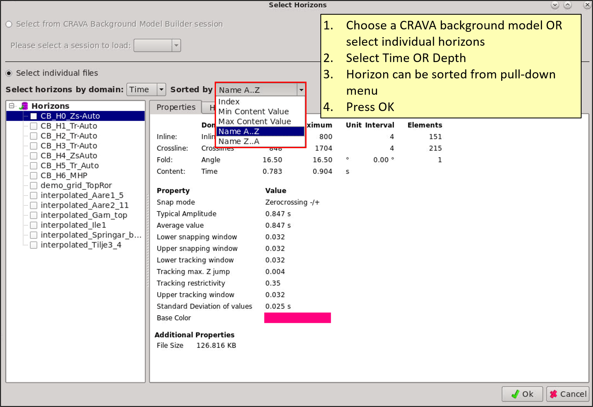
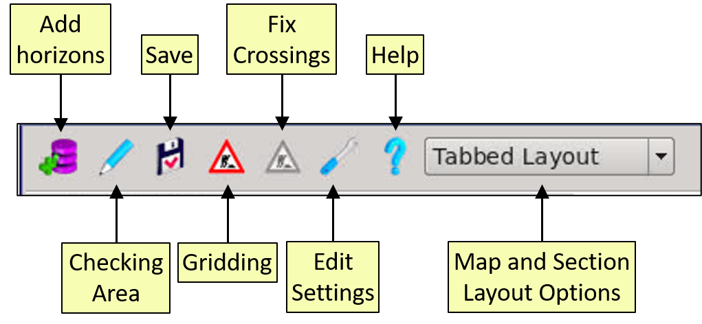
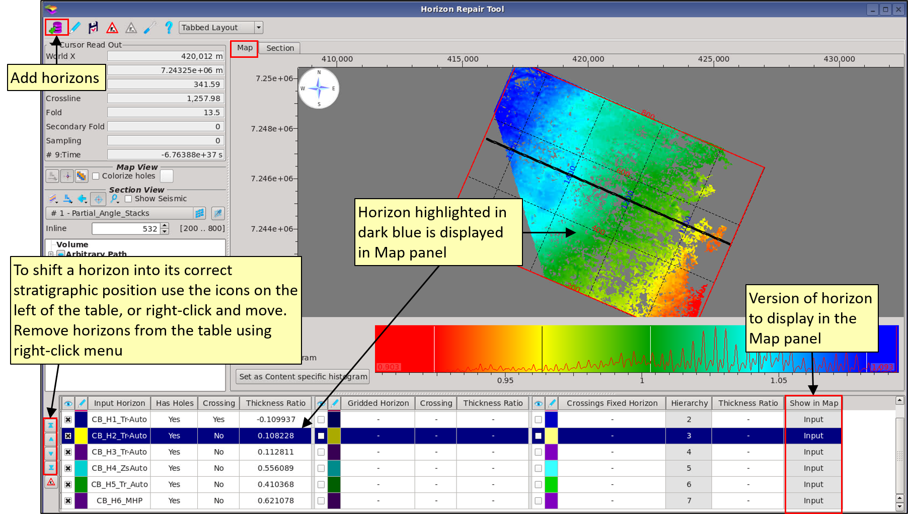
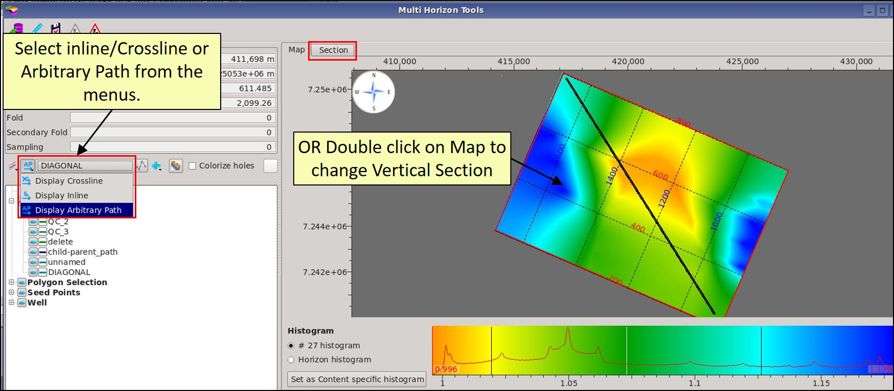
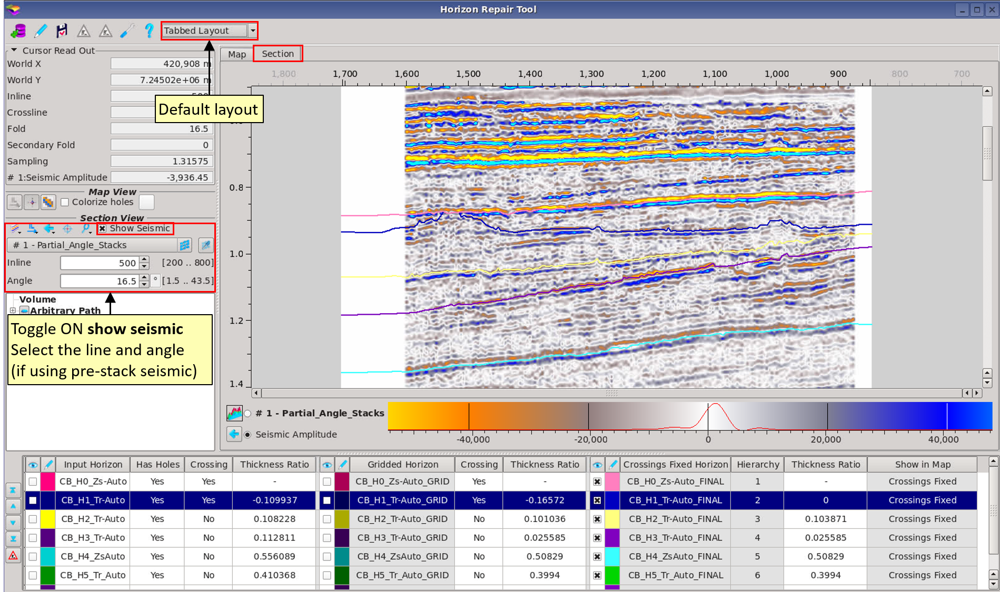
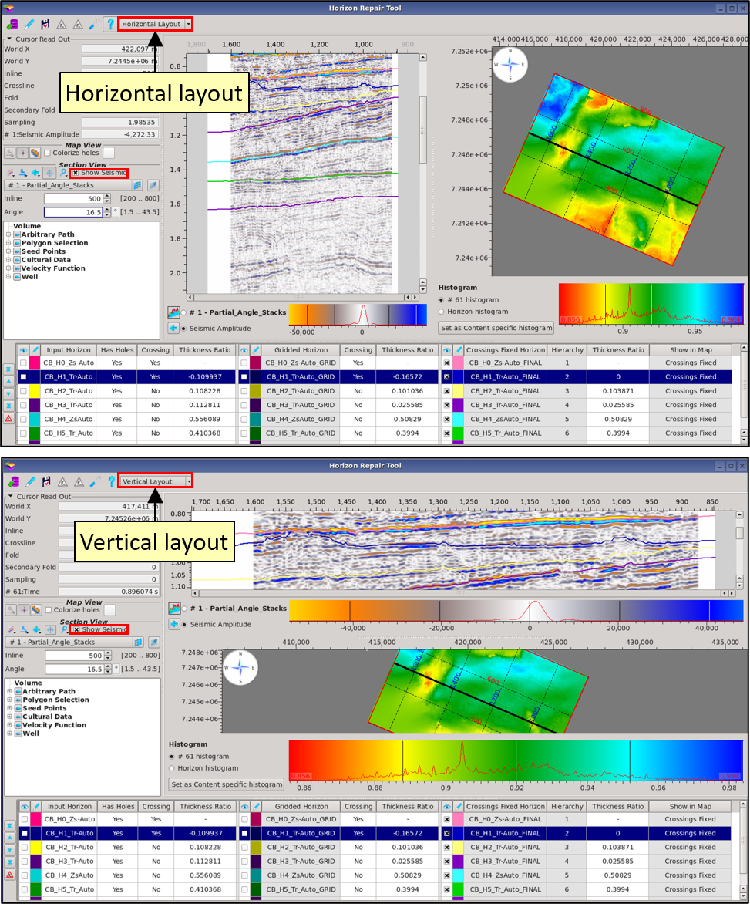

# Horizon Repair Tool

The Horizon Repair Tool is designed to fill holes in horizons and fix crossing errors to generate complete grids acceptable for input to CRAVA and PCube+, in addition to general interpretation use. The tool is in the **Interpretation-Processing** menu. 

The workflow is as follows:

1. **Load input horizons**
2. **Run Gridding**
3. **Check the stratigraphic order and hierarchy**
4. **Run Fixed Crossings**
5. **QC results**

The two functions are: 

* _Gridding_: ABOS gridding is applied in a batch method to all horizons in the table. The lateral extents are defined by the **Checking Area**.
* _Fixed-Crossing_s: the **stratigraphic order** AND **hierarchy** are used to define the priority order of fixing horizons that cross each other. Fixed Crossings can be applied in an iterative way, with the user changing stratigraphic order and hierarchy and rerunning the function to achieve the desired results.

The user has the option to load a **CRAVA background model**, or select the horizons from the project. These can be in time OR depth, but cannot be pre-stack surfaces.  The  horizon selection can be changed by the user when using the tool, they are not fixed. Input horizons can be: manually picks, 3Dautotracked horizons, a combination of both, or a gridded horizon. 

The tool contains three parts:

* **Map Panel**: displays one horizon, selected in the Data Table by clicking on a row.
* **Data Table**: lists the horizons which must be in stratigraphic order. The table is filled in as _Gridding_ and _Fixed-Crossings_ is applied. 
* **Section Panel**: displays all the horizons in a vertical section which updates automatically as _Gridding_ and _Fixed-Crossings_ is applied.

**The menu at the top of the Tool** contains data selection, saving horizons, defining the checking area, running gridding and fixed-crossings, settings to change suffixes, help, and Map and Section layout options.

**Add Horizons:** Horizons can be added to the table at any point. The Data Table then updates automatically, recalculating whether holes are present, if the horizons cross each other, and their thickness-ratios.

**Save**: The user has the option to save the gridded horizons and/or the fixed-crossing horizons.

**Checking Area**: The user defined lateral range for gridding and checking horizon crossings. This can be larger than the input horizons \(or smaller\).

**Gridding**: The function which grids all the horizons in the table using ABOS.

**Fixed-Crossings**: All horizons are analysed for whether or not they cross each other. According to the priority defined by the stratigraphic order and hierarchy the horizons are edited so they do not cross each other.

**Edit Settings:** change the auto-suffix applied in the table. This can also be edited when saving. Horizon names can be individually changed inside the table and at the point of saving.

Help: shows the information pop-up

**Tabbed Layout:** options to change the layout of the Map and Section tabs. By default the section is in a separate tab. Other options are to display them in the same tab horizontally or vertically.

## Checking Area

The **checking area** defines the lateral extent of the gridding process and can be manually set using inline and crossline ranges, or set to match a volume in the project \(e.g. a seismic volume to be used in CRAVA\), or set to match a file \(e.g. a survey the horizon was not picked on\).

**Note:** horizons can be extended beyond their original range. They can also be "clipped" to a subset of a survey. Gridded horizons and fixed-crossing horizons will fit to the range set in checking area.

The checking area is shown in the Map Panel as a red box.

## **The Map Panel**

The Map panel display the horizon highlighted in the Data Table, with the _Checking Area_ shown as a red box. To change the horizon click on a different row in the table. 

To **remove** a horizon right-click on it in the table and select remove. To **add** a horizon, click on the icon in the menu and select horizons from the project, these will be added to the table. To **shift** a horizon use the icons on the left of the table, or right-click and move.

After Gridding and Fix Crossings has been applied, the user can select which version of a horizon to display in the Map panel. The table contains a column "**Show in Map**", choose from a pull-down menu the version of that horizon to be displayed in the Map panel.

## **The Section Panel**

The **section view** displays the horizons in a vertical section, as either an inline, crossline or arbitrary path. Select the vertical section location by **double clicking on the Map Panel** OR **selecting from the tree** on the left.

The different versions of each Horizon can be toggled on/off in the table, with each version of the horizon being automatically assigned a contrasting colour. Next to each column for Input, Grid and FC is an "**eye**". Toggle the eye ON to show that version in the Section panel. All three versions of the same horizon can be displayed simultaneously. As _Gridding_ or _Fixed-Crossings_ is performed the Section panel auto-updates the display.

 To change the colour of a horizon click on the colour icon in the table and select a new one.

To display seismic in the Section Panel toggle ON **show seismic**

Change the _tabed layout_  to display the Map and Section Panels side-by-side.

## **The Data Table**

The Data Table lists all of the horizons and their different versions: input, grid and fixed-crossing. The names of the gridded and fixed-crossing versions can be changed by double-clicking in the cell.

Each row equates to one horizon, with columns filling in as G_ridding_ and _Fixed-Crossings_ is run. The "eye" next to each horizon version controls the display of it in the Section Panel. In the Map Panel only one version of a horizon can be shown at any one time, and the control for this is the last column: "Show in Map"

The input horizons are automatically analysed for holes and if they cross each other. The results are listed in the table. The **thickness ratio** \(min isochron thickness / max isochron thickness\) is automatically calculated. The order of the horizons is important; the user must ensure the horizons are in stratigraphic order in order to apply Fix Crossings correctly. To change the order, select a horizon, right click and select move up/down or to top/bottom. Hierarchy must also be set for each horizon, and is not the same as stratigraphy.

## **Gridding**

**Gridding** fills holes in the horizons and extends them to match the **checking area**. This is done in a batch mode with all horizons being gridded using the **ABOS** gridding method. The grids are added to the table \(with the suffix \_G\) and by default are displayed in the Section panel. Crossings are re-calculated, as are thickness ratios.

## Fixed Crossings

Once gridding as been performed, **Fixed Crossings** can be run. The hierarchy and stratigraphic order defines how the crossings are terminated. These can be changed and Fixed Crossings rerun multiple times to produce the correct result.

Click on the horizon name to shift its stratigraphic position in the table. Click in Hierarchy and select from the drop-down menu to change the number, with 1 being the top priority.

## Stratigraphic Order versus Hierarchy

Stratigraphic order and Hierarchy achieve different results as follows:

## Saving

Save grids and/or fixed-crossing horizons to the project. By default grids are given the suffix **\_G** and the fixed-crossing horizons have the suffix **\_FC.**

**The names can be changed in the Data Table or when saving by clicking on the name.**

