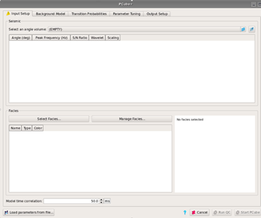

# Pcube+

PCube+ is a one-step prestack inversion that takes partial angle stacks as input, along with a set of litho-fluid classes \(LFCs\) defined from well data. Examples of LFCs might be an oil sand, a brine sand, and a shale. The main output from PCube+ is a probability cube for each LFC. PCube+ also produces elastic property cubes and updated horizons if desired.

The inversion method in Pcube+ is an elastic method, based on the work of Buland, Omre and others \(Geophysics, 2003; Geophysics, 2008\). 

As with most pre-stack inversions, a prior model and wavelets are also required. The horizons defined in the prior model are updated during the inversion, providing new horizons with the uncertainty range included.

The user will need to define input parameters, set up a background model and specify transition probabilities before running the inversion. Tuning of parameters will also be necessary. Output volumes and maps from the inversion will appear in the Data Pool.

An inspection window, **Pcube+ Inspector**, provides the user with the possibility to review the output data in a similar way to the Parameter Tuning tab.

The user interface is opened in **Interpretation-Processing** → **Pcube+**

Currently, Pcube+ does not support using arbitrary lines.

_The graphical user interface at startup of Pcube+_

