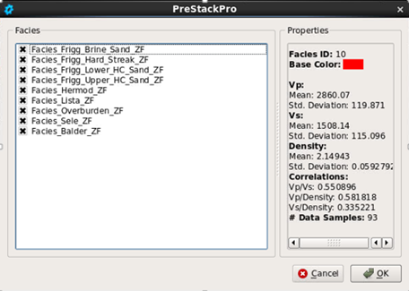

# Input Setup

In the **Input Setup** tab, the seismic data and litho-fluid classes to be used in the inversion are specified.

_Graphical user interface for the Input Data tab_

**Seismic data**

The input seismic volume to Pcube+ is a set of angle stacks. They cannot be loaded into Pcube+ as separate angle stacks. Instead, a pseudo pre-stack volume containing these angle stacks must be created, see [Create Pseudo Pre-Stack](../../../utilities_and_setting/create_pseudo_pre-stack.md) and [Offset to Angle](../offset_to_angle.md). The pseudo pre-stack volume must be loaded from the volume pool into Pcube+. The algorithm uses the Aki & Richards three term approximation. The optimum number of stacks should bee tested. Generally, 5-10 stacks are recommended, but this can be tested as part of the inversion parameter tuning. After the angle stacks have been loaded, they appear in a table in the Input Setup tab with the corresponding angle defined.

For each angle stack, a wavelet must be loaded from the project. The wavelets can be unique for each angle stack, or one wavelet can be used for all the stacks. Pcube+ does not accept time-variant or space-variant wavelets. The wavelets must have their first sample before time zero and their last sample after time zero. If necessary, the wavelets can be edited in the wavelet tool.

,The signal-to-noise ratio and a scaling factor for the wavelet must also be specified for each angle stack. The signal-to-noise ratio \(S/N\) may be determined from well-ties or directly from the data. If the wavelet extraction was performed using Roy White’s method, then S/N can be obtained from the PEP by S/N = PEP/\(1-PEP\). Note that S/N from well-tie tends to underestimate the S/N as it is also sensitive to mistie, whereas estimating S/N from seismic correlation analysis tends to overestimate S/N because migration and other spatial mixing processes introduce correlations iinto the noise. S/N is used as a data weighting factor in the inversion. This allows simple testing of which stacks to use in the inversion: if the signal to noise ratio is set to a very low value \(eg 0.01\) for one angle stack, it is effectively downweighted so much that it is not used in the inversion, although it will still be shown in the QC displays.

The wavelet scaling factors may be used to apply angle-dependent scaling to the data. However, if the wavelets have been extracted from the angle stacks by well-tie, then scale factors are normally built into the wavelets. The scale factors have a significant effect on the inversion result, and it is recommended to tune them during the QC process \(see the section on Parameter Tuning\).

**Litho-Fluid Classes**

A set of litho-fluid classes \(LFCs\) must be selected for the given Pcube+ model. Each LFC is intended to correspond to a distinct litho-class in a $$V_p$$-$$V_s$$-$$\rho$$ cross plot. Typically, they come from wells in or close to the inversion area.

The well logs should be QC’d and preconditioned carefully. The elastic properties in the zones of interest should be cross-plotted. This allows identification of distinct classes. LFCs can be defined from well log data in PreStack-Pro by using the well log and cross-plotting tools, or by external import. For external import each LFC must be defined separately in an ASCII file by three columns, $$V_p$$ \(m/s\), $$V_s$$ \(m/s\) and density \($$g/cm^3$$\) and no file header.

_List of LFCs in the Facies Manager_

The LFCs are stored in Pre-Stack Pro’s Facies Manager. By clicking on **Select Facies** in the Input Setup tab, a list of all LFCs in the Pre-Stack Pro project appears. The LFCs that are toggled on will be included in the Pcube+ model. Clicking on [**Manage Facies**](../../../utilities_and_setting/manage_facies.md) will open the facies manager for import of new LFCs or editing of existing ones.

For each class in the list of selected LFCs, an id number is defined in parenthesis. This number identifies the selected LFC in the prior and post probability cubes.

The **Model time correlation** parameter affects vertical smoothness in the inversion results. Smaller values produce noisier looking results and may increase the dynamic range seen in the elastic properties output from the inversion.

The **Angle variogram nugget ratio** describes the uncorrelated noise level considered across the angle stacks. Typically adjacent partial angle stacks are highly correlated due to processing, so this value will be small.

The **Angle correlation range** describes the angular range over which noise becomes uncorrelated. Actually this would normally be quite large \(say,  25 degrees\) , but it can be used with lower values to treat the data independently. It may be worth testing this parameter if the inversion acoustic impedance matches the well logs but the Vp/Vs does not.

