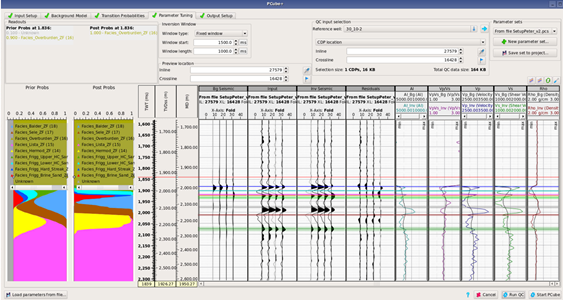
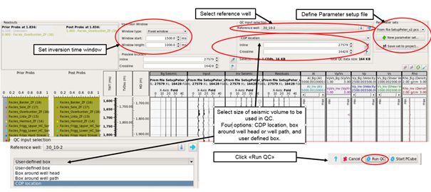
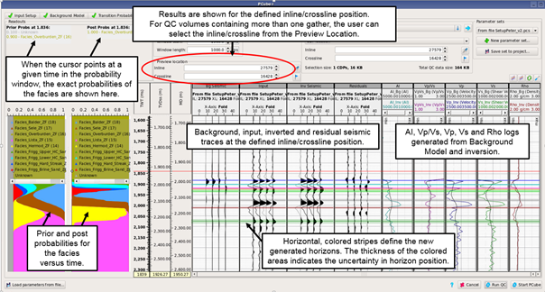

# Parameter Tuning

In the Parameter Tuning tab quality checks can be run in order to tune the parameters for the inversion. The input selection for the QC can either be specified at a well position, a CDP location, or for a box with a user defined inline and crossline range.

The following figure shows what  the Parameter Tuning panel looks like after running a QC test.

_Overview of the Parameter Tuning panel after running a test_

Before running the QC test, the inversion window must be specified, a reference well selected, and the input selection range defined.

A Parameter Setup file can also be defined and saved. This file contains all necessary information to restart Pcube+ with the same parameter setup as used. The file extension is \*.pcs. Parameter files are loaded into Pcube+ in the Input Setup tab.

_Setup details for the Parameter Testing_

After running a QC, the prior and posterior litho-facies probabilities as a function of time are seen to the left.

In the middle, seismic data are shown; background model, input seismic data, inverted seismic data, residual seismic. To the right, well log data from the background model and the inversion results.

At the top, the preview location can be edited if the QC was run using a more than one gather.

The colored stripes define the location of the new horizons. The width of the stripes indicates the uncertainty range.

_Parameter tuning results after running a QC_

In the figure below, some extra functionalities in the parameter tuning window is shown.

By clicking on the Show Display Controls button, the extra display controls become available. Reference logs can be toggled on to become visible in the log tracks. Showing horizon lines can also be toggled on.

It is also possible to select synchronization or opening stack viewer to visualize both output seismic volumes and posterior probabilities.

_Some extra functionalities_

