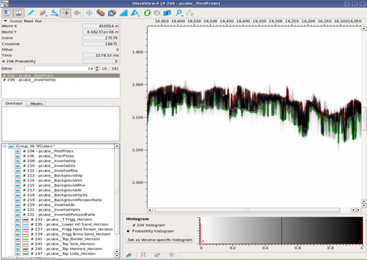
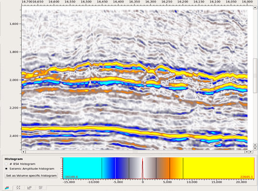
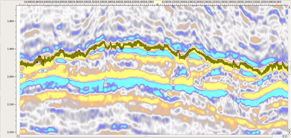

# Results

After an inversion is completed, the posterior probability cube will always appear in the Data Pool. Other outputted volumes and horizons will appear in the Data Pool if they have been toggled on in the Output Setup before running the inversion.

All the output data from the inversion are grouped together, and can be accessed in the viewers. It is also possible to look at the output horizons in these viewers.

It is not yet possible to put a probability cube and a seismic volume into the same viewer due to different data domains. So, when a probability cube is dragged into the viewer, the seismic volumes do not appear in the grouped list in the viewer. Similarly, if a seismic volume is dragged into a viewer, the probability cubes do not appear in the grouped list.

In the figure below the posterior probability for one litho-facies is shown with two inversion generated horizons included.

_The viewer includes the posterior probability for a litho-facies. Two updated horizons have also been toggled on._

The litho-facies in the probability cubes are identified by the index value of the facies.

_Index value identifies the litho-facies._

The figure below shows an example of an inverted seismic volume. The inverted volume, by default, appears in the viewer as any regular seismic volume, using the Seismic Amplitude histogram.

_Inverted seismic volume_

In the figure below, a horizon, with included uncertainty, are overlaying a seismic inverted volume.

_Inverted seismic volume with an uncertainty horizon overlaid_

To visualize an **uncertainty** horizon in a viewer, as seen in the figure above, a **stack** volume has been generated in the volume calculator using the horizon and its uncertainty map as input to a predefined Gaussian function. This stack volume is then loaded into the viewer.

