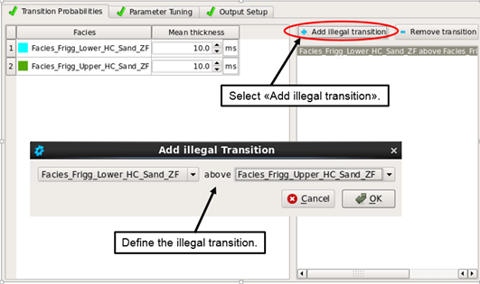

# Transition Probabilities

PCube+ considers each sample to be a micro-layer that can have its own LFC. The transition probabilities capture geological information about the thickness and ordering of classes. This is done by considering the probability, if a particular sample has one LFC, of what can happen in the next sample down. As an example, if an LFC represents a thin limestone stringer, then if one sample is assigned to that LFC it is unlikely that the next sample will be the same LFC \(because the limestone is thin\), so the probability of transitioning from limestone into limestone is small, and the probability of transitioning into something else is correspondingly higher. On the other hand, if an LFC represents a thicker, blocky sand, there is a high probability of staying in the sand when moving down by one sample. Thus, the probability of staying in the same LFC captures thickness information. As a second example, in general a brine sand is not expected immediately above a gas sand. This information is equivalent to setting the probability of moving from brine sand down into gas sand at zero. 

Transition probabilities can be specified in two ways, and the choice affects the interpretation of the prior probabilities set in the previous tab.

 In the explicit case, the user defines the transition probabilities in a matrix for each interval. The diagonal entries, which represent going from one LFC into the same one in the next sample down, are determined from the mean thicknesses given for each LFC. The off-diagonal elements of the matrix contain the probability of going from one LFC into a different one. In this method, the prior probabilities defined in the previous tab are used as the marginal probabilities at the top \(first sample\) of the interval. Those probabilities, together with the transition matrix, are enough to define the prior marginal probabilities throughout the layer.

In the parametric specification, the mean thicknesses are still defined by the user per LFC, and they still determine the diagonal elements of the transition matrix. However, the prior marginal probabilities are now set for all samples by the user-defined prior model, and PCube+ internally determines transition matrices that would give rise to them.

In the **Transition Probabilities** tab, there is a choice between using the parametric matrix method and the explicit.

The user interface for the parametric method is seen in the figure below.

_The Transition Probabilities window for the parametric transition matrix_

If the parametric transition matrix is chosen, it is possible to define illegal transitions. The purpose of these rules is to exclude non-geological and non-physical layering: for example, water bearing sand above gas sand.

The following example illustrates the use of illegal transition rules. Two LFCs are defined in the layer, a lower and an upper hydrocarbon bearing sand. The lower sand must be located below the upper sand. The illegal transition rule will therefore be: The Lower HC sand LFCis not allowed to exist above the Upper HC LFC.

_Defining illegal transition rules._

The _window length_ parameter is the number of samples used in the exhaustive search of LFC combinations when comparing the seismic data to the inversion synthetic. Larger values usually improve the results, especially if the mean layer thicknesses are small, but it also affects the run time dramatically. If N is set for this parameter, and there are K distinct LFCs, and no illegal transitions, then the number of combinations is $$K^N$$.

The user interface for the explicit transition matrix option is shown below.

